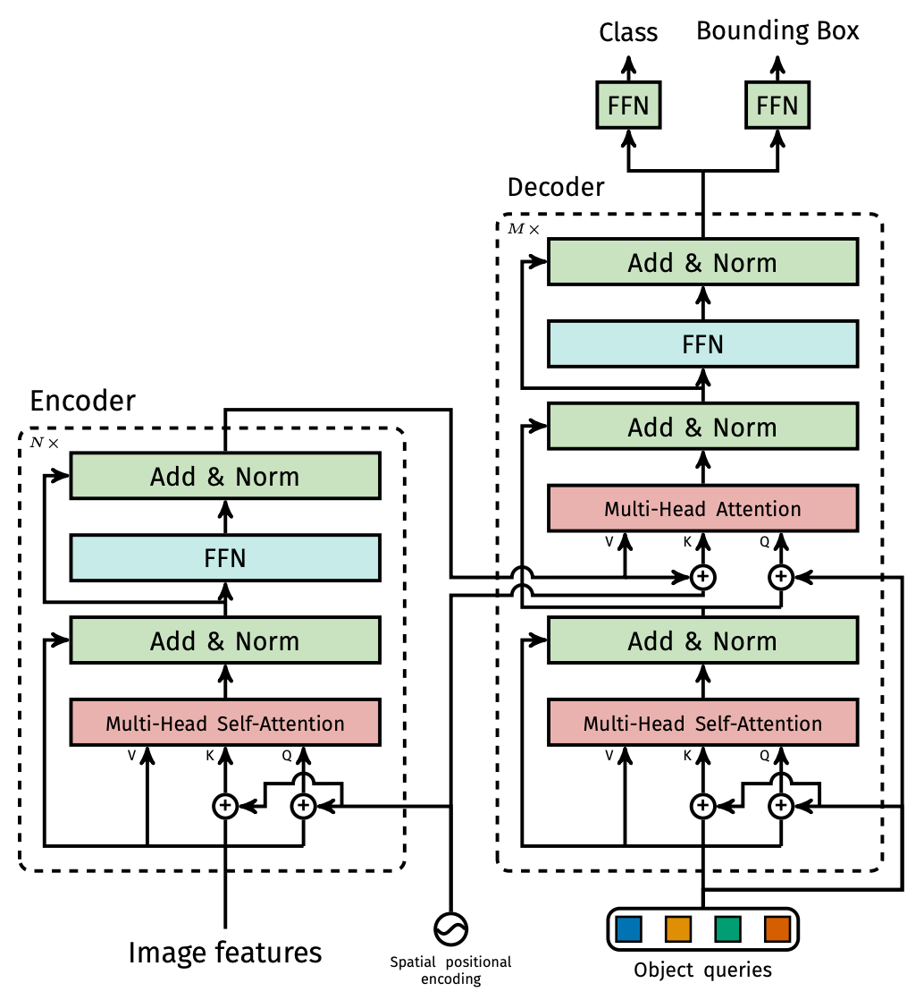

    
<h1>DETR系列模型速览</h1>

	 
    

        <b>作者：</b><b>elfin</b>  
        <b>资料来源：<a href="">github</a></b>
	

[toc]

---

    <b><a href="#top">Top</a></b>
	 <b>---</b> 
	<b><a href="#bottom">Bottom</a></b>

# 1、DETR模型速览

**DETR** (**DE**tection **TR**ansformer), DETR模型是开山鼻祖，主要贡献是：

1. VIT后面接了一个输入带有query的decoder解码器；
2. 训练时预测与GT匹配使用匈牙利匹配，避免使用NMS过滤预测；

---

## 1.1 DETR模型结构

1. backbone中的CNN是默认使用ResNet50, 然后平铺HW维度（默认使用最后一层的输出）；
2. encoder部分是将backbone的输出和对应的特征图位置编码相加，得到Transformer编码器的输入，encoder默认是迭代6次，每次输入都是位置编码和上一次的输出（第一次是backbone输出）；
3. decoder是DETR的核心，和Transformer模型不一样是，decoder的输入是encoder的最后一层输出和query。encoder最后一层输出会作为$K，V$传给decoder的每一层，实际上decoder是一直在迭代(默认6次)query，最后模型将每一层的输出query使用全链接输出最后的预测。
4. query的初始化是使用全0初始化，问什么是全0初始化？实际这里就是工程最简原则，0也恰好对应着最开始时没有任何先验信息，每一次的query迭代，输入下一个Layer都会先将位置编码和query相加，第一次是0向量与位置向量相加，所以说是全0初始化。

## 1.2 模型匹配

object queries默认设置为100个，这里和传统decoder不同，没有使用mask，所有query都是并发的。是否选择所有decoder层的输出进行FFN输出预测也是可选的。DETR第二个关键点就是在训练中使用匈牙利算法进行预测和GT的匹配，索引匹配后再进行损失计算。

---

    <b><a href="#top">Top</a></b>
	 <b>---</b> 
	<b><a href="#bottom">Bottom</a></b>

---

    <b><a href="#top">Top</a></b>
	 <b>---</b> 
	<b><a href="#bottom">Bottom</a></b>

---

    <b><a href="#top">Top</a></b>
	 <b>---</b> 
	<b><a href="#bottom">Bottom</a></b>

# 参考资源

1. [DETR系列总结--知乎](https://zhuanlan.zhihu.com/p/680900567)
2. 

    <b>完！</b>

