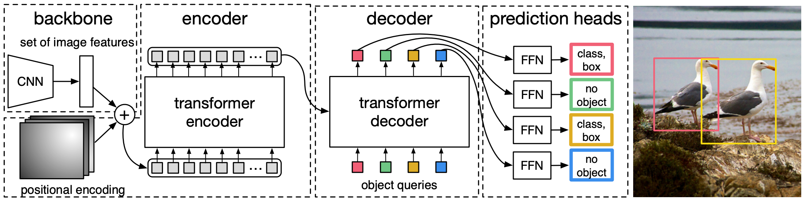

<!-- markdownlint-disable MD033 -->

    
<h1>DETR系列模型速览</h1>
 
    
<b>作者：</b><b>elfin</b><b>资料来源：<a href="">github</a></b>

[toc]

---

    <b><a href="#top">Top</a></b><b>---</b><b><a href="#bottom">Bottom</a></b>

## 1、DETR模型速览

**DETR** (**DE**tection **TR**ansformer), DETR模型是开山鼻祖，主要贡献是：

1. VIT后面接了一个输入带有query的decoder解码器；
2. 训练时预测与GT匹配使用匈牙利匹配，避免使用NMS过滤预测；

---

### 1.1 DETR模型结构

1. backbone中的CNN是默认使用ResNet50, 然后平铺HW维度（默认使用最后一层的输出）；
2. encoder部分是将backbone的输出和对应的特征图位置编码相加，得到Transformer编码器的输入，encoder默认是迭代6次，每次输入都是位置编码和上一次的输出（第一次是backbone输出）；
3. decoder是DETR的核心，和Transformer模型不一样是，decoder的输入是encoder的最后一层输出和query。encoder最后一层输出会作为$K，V$传给decoder的每一层，实际上decoder是一直在迭代(默认6次)query，最后模型将每一层的输出query使用全链接输出最后的预测。
4. query的初始化是使用全0初始化，问什么是全0初始化？实际这里就是工程最简原则，0也恰好对应着最开始时没有任何先验信息，每一次的query迭代，输入下一个Layer都会先将位置编码和query相加，第一次是0向量与位置向量相加，所以说是全0初始化。

### 1.2 模型匹配

object queries默认设置为100个，这里和传统decoder不同，没有使用mask，所有query都是并发的。是否选择所有decoder层的输出进行FFN输出预测也是可选的。DETR第二个关键点就是在训练中使用匈牙利算法进行预测和GT的匹配，索引匹配后再进行损失计算。

---

    <b><a href="#top">Top</a></b><b>---</b><b><a href="#bottom">Bottom</a></b>

## 3、GroundingDINO 模型

论文：[https://arxiv.org/abs/2303.05499](https://arxiv.org/abs/2303.05499)

项目：[https://github.com/IDEA-Research/GroundingDINO](https://github.com/IDEA-Research/GroundingDINO)

GroundingDINO模型是典型的grounding任务，它是一种**双编码器单解码器架构**。他包含一个视觉编码器的backbone，一个文本编码器的backbone，一个融合视觉嵌入和文本嵌入的多模态编码器(**特征增强编码器**)，一个**跨模态解码器**，还有一个**用于查询初始化的语言引导式查询选择模块**。结构图如下：

### 3.1 特征提取器和特征增强器

两个特征提取器，分别为：文本特征提取器BERT（预训练模型）、图像特征提取器SwinTransformer(预训练模型)。
一个特征增强器，这个结构和DETR的特征增强是有本质区别的。如上图block2所示，文本输入的嵌入特征是先使用自注意力机制，图像输入的嵌入特征先使用可变形自注意力机制(视觉)，整备好输入后，经过`Image2Text`和`Text2Image`交叉注意力机制分别调制文本编码和视觉编码，最后再分别经过FFN结构融合特征。这样的layer经过堆叠就组成了特征增强器。每一层都有文本、图像编码融合，有利于模型做grounding任务，只是局部连接两种模态可能会导致特征很难对齐。

### 3.2 语言引导式查询选择

语言引导式query选择公式如下：

$$
\mathbf{I}_{N_{q}} = \text{Top}_{N_{q}} \left( \text{Max}^{-1} \left( \mathbf{X}_{I} \mathbf{X}_{T}^{\text{T}} \right) \right)
$$

其中：

1. $\mathbf{X}_{I} \in \mathcal{R}^{N_{I} \times d}$ 是图像特征；
2. $\mathbf{X}_{T} \in \mathcal{R}^{N_{T} \times d}$ 是文本特征；
3. $d$ 取值256；
4. $N_{I}$ 使用10000；
5. $N_{T}$ 小于256；
6. $N_{q}$ 沿用DINO的 900 (DETR是100个query)；

遵循DINO，我们使用混合查询选择来初始化解码器查询。每个解码器查询包含两个部分：**内容部分**和**位置部分**。我们将位置部分表述为动态锚框，它们用编码器输出进行初始化。另一部分（内容查询）设置为在训练期间可学习。

### 3.3 跨模态解码器

如上图block3所示，跨模态解码器的layer输入为跨模态的Query(如语言引导式查询所示，query的数值是图像特征和文本特征的积)，现对Query做自注意力机制挖掘特征更新query，再进行query与图像特征的交叉注意力挖掘特征并更新query，然后query与文本特征进行交叉注意力建模，最后使用FFN投射到输出空间。堆叠这样的layer就组成了跨模态解码器。

### 3.4 子句级文本特征

如上图所示，(a)是句子级文本特征，它舍弃了部分词，导致其丢失细粒度信息；(b)是词级文本特征，它保留了全部词，但在句子间引入了不必要的依赖关系；(c)是子句级别的文本特征，它保留了子句内所有的词语，并在子句内部保留上下文依赖，从而避免不同句子产生不必要的依赖关系。

### 3.5 损失函数

损失函数包括：

1. 类似DETR中的L1损失和GIOU损失进行边界框回归；
2. 参考GLIP的损失函数，计算预测对象和语言文本嵌入之间的对比损失；
    - 解码器输出的query与文本嵌入点积，得到与每个文本的logits，然后计算focal loss；
    - box回归和分类是基于GT和预测间的二分匹配计算损失；
    - 我们在相同的损失分量(匹配上)的GT和匹配到的预测之间计算最终损失；
    - 类似DETR模型，在解码器的每一个layer我们都添加辅助损失。

---

    <b><a href="#top">Top</a></b><b>---</b><b><a href="#bottom">Bottom</a></b>

### 3.6 源码解析

#### 3.6.1 caption处理

处理逻辑：

1. 字符全部转为小写，并保障caption以`.`结尾。

#### 3.6.2 加载模型

模型加载逻辑：

1. 入参配置模型超参文件model_config_path, 模型权重文件model_checkpoint_path, GPU设置device。
2. 加载超参数配置文件, 文件格式参考`mmcv.utils.config`, 。

---

    <b><a href="#top">Top</a></b><b>---</b><b><a href="#bottom">Bottom</a></b>

---

    <b><a href="#top">Top</a></b><b>---</b><b><a href="#bottom">Bottom</a></b>

### 参考资源

1. [DETR系列总结--知乎](https://zhuanlan.zhihu.com/p/680900567)

    <b>完！</b>

<!-- markdownlint-enable MD033 -->