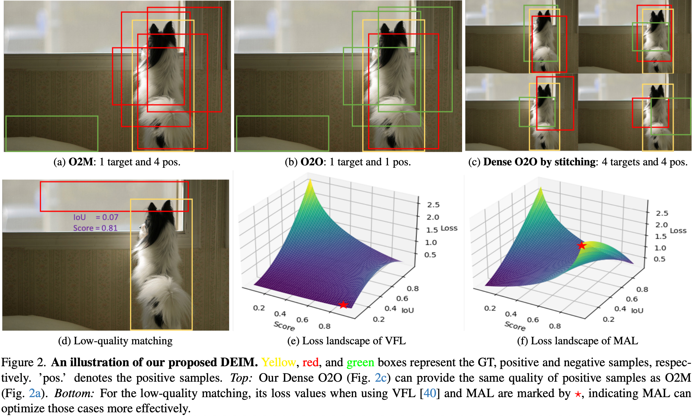
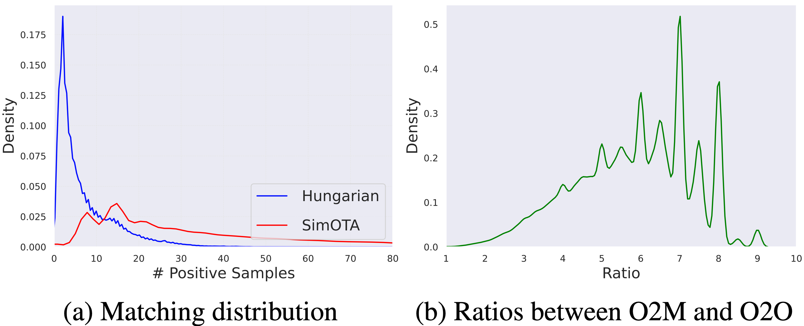

<!-- markdownlint-disable MD033 -->

    
<h1>DETR实时系列模型速览</h1>
 
    
<b>作者：</b><b>elfin</b><b>资料来源：<a href="">github</a></b>

## DEIM模型速览

> 模型卡片：
>
> - 创新点1: 稠密的one-to-one匹配(**Dense O2O**)
> - 创新点2: 匹配感知损失(**MAL**: Matchability-Aware Loss)
>
> 资源目录：
>
> - 论文：[https://arxiv.org/abs/2412.04234](https://arxiv.org/abs/2412.04234)
> - 代码：[https://github.com/Intellindust-AI-Lab/DEIM](https://github.com/Intellindust-AI-Lab/DEIM)

### 工作简介

**图释**:

- **bbox颜色说明**: 黄色、红色、绿色分别表示GT标签、正样本和负样本;
- **pos**: 表示正样本;
- **Dense O2O by stitching**: 使用4张图片按照$2 \times 2$进行图像的缝合, 实现正样本的扩充; 这种方式提供的正样本和O2M(one-to-many)方案相近;
- **低质量配对**: 指代(d)中那种置信度非常高但是和GT的IOU很低的预测框;
- **匹配感知损失**: 如(e)中$\star$所示, 低质量配对Loss非常低, 这会导致模型收敛到低质量预测空间, 容易出现置信度很高定位却很差的实例. (f)中将低质量预测的损失增大, 能有效抑制这种现象.

### O2O vs O2M

传统目标检测算法, 常采用O2M, 其监督目标可以表示为:

$$
\text{loss} = \sum_{i=0}^{N} \sum_{j=0}^{M_{i}} f(\hat{y}_{i,j}, y_{i})
$$

其中, $M_{i}$表示第$i$个GT实例$y_{i}$的预测数量, $\hat{y}_{i,j}$表示第$i$个GT实例的第$j$个预测框. 所以针对每个GT实例, 目标函数会将多个查询将其匹配起来. O2O就是O2M的一种特殊情况, (使用匈牙利匹配)即每个GT实例仅有一个预测框, $M_{i}=1$.

### Focal Loss

Focal Loss(FL)是传统检测器的常用目标函数, 未来防止数量庞大的容易负样本对模型的指导占据主导, 需要将模型的注意力直接聚焦到困难样本上. 这也是DETR改进模型的常用分类损失函数. 其公式为:

$$
\mathbf{FL} (p,y) = \begin{cases}
  & -\alpha \left ( 1 - p \right )^{\gamma } \log{\left ( p \right ) }   & y = 1\\
  & - \left ( 1 - \alpha  \right )p^{\gamma } \log{\left ( 1 - p \right ) } \quad & y = 0
\end{cases}
$$

其中 $y ∈ \left \{0, 1\right \}$ 指定GT类别, $p ∈ \left [0, 1 \right ]$ 表示前景类的预测概率。参数$\gamma$控制简单样本和困难样本之间的平衡，而$\alpha$调整前景类和背景类之间的权重. 在$\mathbf{FL}$中, 仅考虑样本的类别和置信度，而不考虑边界框质量, 即定位(置信度无框的回归质量无关).

困难样本、简单样本的定义:

- 简单样本：对于正样本(前景)：$p \rightarrow 1$，对于负样本(背景)：$p \rightarrow 0$. 这些样本的损失值很小, 对梯度贡献微弱.
- 困难样本：(前景)：$p \rightarrow 0$，对于负样本(背景)：$p \rightarrow 1$. 这些样本的损失值很大, 对梯度贡献大.

> 简单样本中, 简单的负样本数量很大, 容易对困难样本的学习造成影响.

#### 二元交叉熵BCE

$$
\mathbf{BCE} (p,y) = \begin{cases}
  & - \log{\left ( p \right ) }   & y = 1\\
  & - \log{\left ( 1 - p \right ) } \quad & y = 0
\end{cases}
$$

Focal Loss 在$\mathbf{BCE}$基础上引入两个因子：

- 调制因子(Modulating Factor)：$ \left ( 1 - p \right )^{\gamma}$(当 y=1) 或 $p^{\gamma}$(当 y=0)
- 权重因子（Balancing Factor）：$\alpha$ 和 $(1-\alpha)$

所以, Focal Loss = BCE × 调制因子 × 权重因子.

#### 权重参数和调制参数

为什么$\alpha$调整前景类和背景类，而不是$\gamma$？

- 因为$\alpha$只和前景、背景有关, 即和$y$的取值相关, 与难易表征无关. 难易的表征是与类别、$p$取值相关的, 而 **$\alpha$只与$y$取值相关**.

为什么$\gamma$平衡难易样本，而不是平衡前景和背景？

- 调制因子中底数不一样, 底数本身与$p$和类别$y$相关, 即 "$ \left ( 1 - p \right )^{\gamma}$(当 y=1) 或 $p^{\gamma}$(当 y=0)" 和难易相关, 所以$\gamma$是难易调制参数.

#### 交叉熵概率论解释

交叉熵在信息论、机器学习中都是非常基础的理论知识, 本节我们从伯努利分布、最大似然的角度给出其概率解释.

针对二分类, 标签$y\in \left\{0,1\right\}$, 其概率分布为:

$$
P(y|x) = \left\{ \begin{array}{ll} p & \text{if } y=1 \\ 1-p & \text{if } y=0 \end{array} \right.
$$

上面的公式我们可以统一表示为:

$$
P(y|x) = p^{y}(1-p)^{1-y}
$$

从最大似然估计(MLE)出发, 我们让位观测到的情况就是最容易发生的事件, 即概率是最大的. 所以, 我们希望最大化$P(y|x)$. 以上是单个样本, 要么是正样本, 要么是负样本. 对于多个样本, 我们可以将其联合起来, 得到联合概率分布:

$$
\begin{align}
P(y|x) &=  \prod_{i=1}^{N} P(y_{i}|x_{i}) \\
&= \prod_{i=1}^{N} p_{i}^{y_{i}} \left( 1-p_{i} \right)^{1-y_{i}}
\end{align}
$$

也就是说, 我们希望最大化$y$的条件概率$P(y|x)$, 也即最小化负的对数似然函数:

$$
L = - \log{P(y|x)} = - \sum_{i=1}^{N} \left[ y_{i} \log{p_{i}} + (1-y_{i}) \log{(1-p_{i})} \right]
$$

这个公式大家应该很熟悉了, 这就是二元交叉熵的定义. 交叉一词体现在$y_{i}$表示真是标签概率, $p_{i}$表示预测概率.

从上面的公式将类别从二分类扩展到多分类, 我们可以得到:

$$
\begin{align}
P(y|x) &= - \sum_{i=1}^{N} y_{i} \log{p_{i}}
\end{align}
$$

### Dense O2O

O2O默认只将GT实例匹配一个查询query, 这样正样本数量很少监督信号不足. 如上图所示:

- **O2M**: 正样本数量分布比较均衡;
- **O2O**: 匹配数量集中在10以内, 非常稀疏.
- **O2M/O2O**: 比率集中在6～8之间, 即O2M的正样本匹配数量是O2O的7倍左右.

### 匹配感知损失MAL

在实时DETR系列中，我们除来使用Focal Loss之外, 还有VariFocal loss(VFL: 变焦距损失). 为什么要使用VFL损失？

- 因为DETR是使用分类置信度直接获取预测框, 无NMS操作;
- 分类置信度和bbox回归之间无监督信号, 容易出现低质量配对;

> 低质量配对: 指代推理中置信度非常高但是和GT的IOU很低的预测框.

所以VFL损失将预测和GT之间的IOU作为可变的超参数引入损失函数中:

$$
\text{VFL}(p, q, y) =
\begin{cases}
& -q \left( q \log{p} + (1-q) \log{(1-p)} \right) \quad & q > 0  \\
& - \alpha p^{\gamma} \log{(1-p)} \quad & q = 0
\end{cases}
$$

如上所示, VFL的处理是:

- 当$q=0$时, 损失函数与Focal loss保持抑制.
- 当$q>0$时: (IOU>0)
  
  - 高质量预测: 置信度$p$较大, IOU数值$q$很大, VFL损失很小.
  - 低质量预测: 置信度$p$较大, IOU数值$q$很小, VFL损失很小.

所以, VFL会收敛到低质量预测空间, 导致回归定位质量很差. 即低质量预测从Focal loss、CE损失到VFL损失, 都没有将低质量问题有效解决. 因此作者提出匹配感知损失MAL, 增大低质量配对的损失.

**MAL的公式**为:

$$
\text{MAL}(p, q, y) =
\begin{cases}
& -q^{\gamma} \log{p} + (1-q^{\gamma}) \log{(1-p)} \quad & y = 1 \\
& - p^{\gamma} \log{(1-p)} \quad & y = 0
\end{cases}
$$

匹配感知损失的改进点:

- 引入$q^{\gamma}$作为可变调制参数, 使得低质量配对的损失增大, 有效抑制低质量预测.
- 去除$\alpha$防止高质量框损失在训练中过于主导.

> 注意$\gamma$数值是1.5, 实验取值范围在$[1.3, 2]$之间.

如简介中的分布图所示, 低质量配对的损失从零增大到较高的水平, 能有效抑制低质量预测.

<!-- markdownlint-enable MD033 -->
