<!-- markdownlint-disable MD033 -->

    
<h1>YOLO系列模型速览--V1～V11</h1>
 
    

        <b>作者：</b><b>elfin</b>  
        <b>资料来源：<a href="https://github.com/ultralytics/ultralytics/blob/main/ultralytics/nn/modules/block.py">ultralytics</a></b>
	

[toc]

## 1、ultralytics 基础layer

Ultralytics 库的 `nn.modules.conv.py`记录了一些基础的layer，block记录了一些常用的模块，本章将介绍这些基础层。

### 1.1 Conv

一个标准卷积层，其参数为ch_in, ch_out, kernel, stride, padding, groups, dilation, activation。

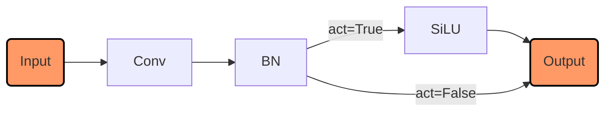

* c1: ch_in, 输入通道数量
* c2: ch_out, 输出通道数量，即需要多少卷积核进行特征抽取
* k: kernel, 卷积核的大小, 默认为1
* s: stride, 卷积核移动的步长, 默认为1
* p: padding, 特征图扩展的大小
* g: groups, 通道分组的数量，卷积核数量一般是其整数倍
* d: dilation, 膨胀系数 参考：[https://github.com/vdumoulin/conv_arithmetic/blob/master/README.md](https://github.com/vdumoulin/conv_arithmetic/blob/master/README.md)
* act: activation, 激活(非线性函数)

### 1.2 DWConv 深度卷积

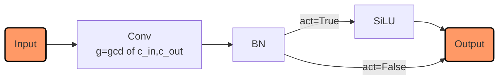

> 继承与Conv模块，group分组参数设置为输入通道和输出通道数的最大公约数

### 1.3 LightConv 轻量化卷积

点卷积+深度卷积

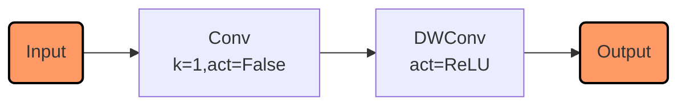

### 1.4 ConvTranspose 转置卷积｜反卷积

转置卷积、反卷积也称解卷积(数学名词)。ultralytics继承了nn.ConvTranspose2d。

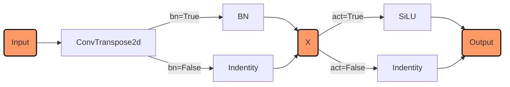

### 1.5 DWConvTranspose2d 深度转置卷积

在nn.ConvTranspose2d的模块参数上设置group分组参数为输入通道和输出通道的最大公约数。

### 1.6 GhostConv 幻影卷积

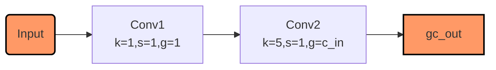

GhostConv卷积核LightConv本质是一样的, 这里的变换时点卷积加一个卷积核大小为5的深度卷积。

### 1.7 RepConv 重构卷积

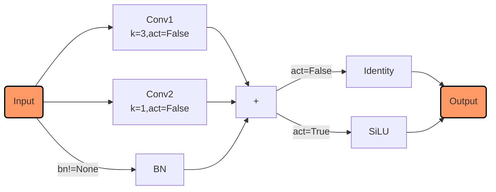

RepConv是起源于RepVGG模型，RT-DETR也使用这个模块！

### 1.8 ChannelAttention 通道注意力

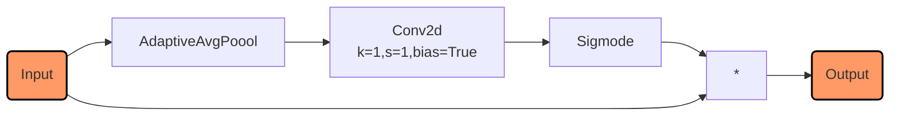

Conv2d的卷积核数量是通道数量。自适应平均池化输出map大小是$1\times1$。所以Conv2d相当于全联接。

### 1.9 SptialAttention 空间注意力

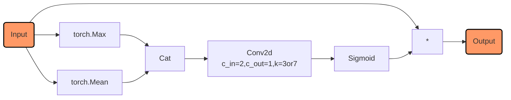

经过$Max$和$Mean$处理分别得到最大值特征图和均值特征图，合并后使用卷积融合两个特征图，经过sigmoid处理得到空间注意力特征图，与输入想乘得到输出。

### 1.10 CBAM 卷积块注意力模型

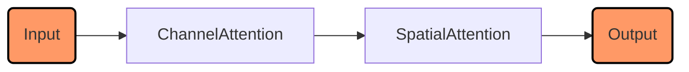

CBAM就是通道注意力模块 + 空间注意力模块。

---

<b><a href="#top">Top</a></b><b>---</b><b><a href="#bottom">Bottom</a></b>

## 2、YOLOv11 基础模块

V11的创新主要是：C3K2和C2PSA，详情如下。

### 2.1 C3K2结构详细说明

相关结构示意图：

```mermaid
graph TD
classDef customStyle fill:#f96,stroke:#000,stroke-width:2;
classDef customStyle2 fill:#f233,stroke:#000,stroke-width:2;
subgraph C3K2
 C3K2_input(Input) --> C3K2_conv1[Conv1]
 C3K2_conv1 --> C3K2_chunk[Chunk]
 C3K2_chunk --> C3K2_cat[Cat]
 C3K2_chunk --> C3K2_b1[C3K_1<br/>n=2]
 C3K2_b1 --> C3K2_b2[C3K_2<br/>n=2]
 C3K2_b2 -.-> C3K2_bn[C3K_n<br/>n=2]
 C3K2_bn --> C3K2_cat
 C3K2_b1 --> C3K2_cat
 C3K2_b2 --> C3K2_cat
 C3K2_cat --> C3K2_conv2[Conv2]
 C3K2_conv2 --> C3K2_out(Output)
 class C3K2_input,C3K2_out customStyle
end
subgraph C3K
 C3K_input3(Input) --> C3K_conv1[Conv1]
 C3K_input3 --> C3K_conv2[Conv2]
 C3K_conv1 --> C3K_b1[Bottleneck1<br/>k1=3,k2=3]
 C3K_b1 --> C3K_b2[Bottleneck2<br/>k1=3,k2=3]
 C3K_b2 -.-> C3K_bn[Bottleneckn<br/>k1=3,k2=3]
 C3K_bn --> C3K_cat[Cat]
 C3K_conv2 --> C3K_cat
 C3K_cat --> C3K_conv3[Conv3]
 C3K_conv3 --> C3K_out3(Output)
 class C3K_input3,C3K_out3 customStyle
end
subgraph C3
 C3_input3(Input) --> C3_conv1[Conv1]
 C3_input3 --> C3_conv2[Conv2]
 C3_conv1 --> C3_b1[Bottleneck1<br/>k1=1,k2=3]
 C3_b1 --> C3_b2[Bottleneck2<br/>k1=1,k2=3]
 C3_b2 -.-> C3_bn[Bottleneckn<br/>k1=1,k2=3]
 C3_bn --> C3_cat[Cat]
 C3_conv2 --> C3_cat
 C3_cat --> C3_conv3[Conv3]
 C3_conv3 --> C3_out3(Output)
 class C3_input3,C3_out3 customStyle
end
subgraph c2f
 input(Input) --> conv1[Conv1]
 conv1 --> chunk[Chunk]
 chunk --> cat[Cat]
 chunk --> b1[Bottleneck1<br/>k1=3,k2=3]
 b1 --> b2[Bottleneck2<br/>k1=3,k2=3]
 b2 -.-> bn[Bottleneckn<br/>k1=3,k2=3]
 bn --> cat
 b1 --> cat
 b2 --> cat
 cat --> conv2[Conv2]
 conv2 --> out(Output)
 class input,out customStyle
end
subgraph C2
 C2_input3(Input) --> C2_conv1[Conv1]
 C2_conv1 --> C2_chunk[chunk]
 C2_chunk --> C2_b1[Bottleneck1<br/>k1=3,k2=3]
 C2_b1 --> C2_b2[Bottleneck2<br/>k1=3,k2=3]
 C2_b2 -.-> C2_bn[Bottleneckn<br/>k1=3,k2=3]
 C2_bn --> C2_cat[Cat]
 C2_chunk --> C2_cat
 C2_cat --> C2_conv3[Conv2]
 C2_conv3 --> C2_out3(Output)
 class C2_input3,C2_out3 customStyle
end
subgraph Bottleneck
 B_input2(Input) --> B_conv1[Conv1<br/>k1=3]
 B_conv1 --> B_conv2[Conv2<br/>k2=3]
 B_input2 -- shortcut --> B_add[+]
 B_conv2 --> B_add
 B_add --> B_out2(Output)
 class B_input2,B_out2 customStyle
end
```

结构说明：

1. Bottleneck：主分支默认conv1(kernel_size=3), conv2(kernel_size=3), shortcut分支是默认开启的，也可以关闭;
2. c2f: 在C2的结构基础上，修改了hidden_channel的大小，Cat操作时将所有Bottleneck的输出都纳入了合并操作，F的含义是Faster;
3. C3: 和C2类似，只是在“shortcut”分支上使用了一个卷积，C2是没有的, C3和C2另一个差异是Bottleneck的第一个卷积卷积核大小修改为1了, 更多差异见结构图;
4. C3K: 在C3的基础上修改了Bottleneck的kernel_size参数，C3默认是kernel_size=[[1, 1], [3, 3]], 修改为kernel_size=[3, 3];
5. C3K2: 使用c2f结构，替换Bottleneck为C3K结构，C3K结构的Bottleneck重复次数为2(即n=2)

---

### 2.2 C2PSA 位置敏感注意力

相关结构示意图如下：

```mermaid
graph TD
classDef customStyle fill:#f96,stroke:#000,stroke-width:2;
classDef customStyle2 fill:#f233,stroke:#000,stroke-width:2;
subgraph C2PSA
 C2_input3(Input) --> C2_conv1[Conv1]
 C2_conv1 --> C2_chunk[Split]
 C2_chunk --> C2_b1[PSABlock1]
 C2_b1 --> C2_b2[PSABlock2]
 C2_b2 -.-> C2_bn[PSABlockn]
 C2_bn --> C2_cat[Cat]
 C2_chunk --> C2_cat
 C2_cat --> C2_conv3[Conv2]
 C2_conv3 --> C2_out3(Output)
 class C2_input3,C2_out3 customStyle
end
subgraph PSABlock
 psablock_input(Input) --> attention[Attention]
 attention --> psablock_add[+]
 psablock_add --> psablock_x(x)
 psablock_input --shortcut--> psablock_add
 psablock_x --> psablock_ffn_conv1[ffn_conv1]
 psablock_ffn_conv1 --> psablock_ffn_conv2[ffn_conv2]
 psablock_ffn_conv2 --> psablock_add2[+]
 psablock_x --shortcut--> psablock_add2
 psablock_add2 --> psablock_out(Output)
 class psablock_input,psablock_out,psablock_x customStyle
end
subgraph PSA
 psa_input(Input) --> psa_conv1[Conv1]
 psa_conv1 --> psa_split[Split]
 psa_split --> a(a) --> psa_cat[Cat]
 psa_split --> b(b) --> psa_atten[Attention]
 psa_atten --> psa_add1[+]
 b --> psa_add1
 psa_add1 --> psa_add2[+]
 psa_add1 --> ffn_conv1[ffn_conv1]
 ffn_conv1 --> ffn_conv2[ffn_conv2]
 ffn_conv2 --> psa_add2
 psa_add2 --> psa_cat
 psa_cat --> psa_conv2[Conv2]
 psa_conv2 --> psa_out[OutPut]
 class psa_input,psa_out,a,b customStyle
end
subgraph Attention
 attn_input(Input) --> qkv_conv[QKV_Conv]
 qkv_conv -- view --> split[Split<br/>key_dim, key_dim, head_dim]
 split --> Q(Q)
 split --> K(K)
 split --> V(V)
 Q --> QK[Q x K]
 K --> QK
 QK -- scale --> softmax[Softmax]
 softmax --> out_attn(attn)
 V --reshape--> attn_pe[pe Conv]
 out_attn --> attn_attnxv[V x attn]
 V --> attn_attnxv
 attn_attnxv --view--> attn_add[+]
 attn_pe --> attn_add
 attn_add --> attn_proj[proj Conv]
 attn_proj --> attn_out(Output)
 class attn_input,attn_out,Q,K,V,out_x,out_attn customStyle
end
```

结构说明：

#### 2.2.1 Attention

**Step1**: 注意力模块，使用一个qkv_conv卷积，生成Q、K、V张量；输入维度为dim，每个注意力头需要的维度为 `dim // head_num`，这个数值就是V张量的信道维度head_dim；设置K张量和Q张量每个head的通道数量为key_dim；qkv_conv输出的通道数量为 `head_num * (2*key_dim + head_dim)`；

**Step2**: Q张量转置与K张量进行矩阵乘法，矩阵乘法的shape变化：`Q_shape=[B, head_num, key_dim, H*W]`，`K_shape=[B,head_num, key_dim, H*W]`，$Q^{T}K$的shape为 `[B, head_num, H*W, H*W]`，先对$Q^{T}K$放缩，再对$Q^{T}K$在最后一个轴应用softmax得到 `attn`注意力特征图；

**Step3**: attn注意力特征图和V张量进行矩阵乘法，矩阵乘法的shape变化：`V_shape=[B, head_num, head_dim, H*W]`，$V@attn$的shape为 `[B, head_num, head_dim, H*W]`，最后还原shape为 `[B, C, H, W]`。

**Step4**: 还原V张量shape为 `[B, C, H, W]`，使用卷积生成偏置，并将结果与step3的输出相加。

**Step5**: 使用投影卷积对特征空间做线性变换。

### 2.2.2 PSABlock PSA基础模块

**Step1**: 输入接入Attention模块，结果和shortcut分支相加；

**Step2**: step1输出结果经过两个前馈卷积处理，再和shortcut分支相加。

#### 2.2.3 PSA 位置敏感注意力机制

**Step1**: 输入接入卷积，卷积输出切分为两个张量a和b；

**Step2**: b张量使用PSABlock处理，合并结果和a张量；

**Step3**: 接入卷积整合不同层级的特征图。

#### 2.2.4 C2PSA

C2PSA模块是使用C2的结构，替换C2中的Bottleneck模块为PSABlock模块。

---

<b><a href="#top">Top</a></b><b>---</b><b><a href="#bottom">Bottom</a></b>

## 3、YOLOv10 基础模块

创新点：

1. **引入C2FCIB结构**：在backbone和neck部分引入了C2FCIB结构，当然不是全部替换V8的C2F结构，作者只应用在backbone和neck的P4、P5部分。
2. **一对一预测分支**：常规的目标检测（DETR是无NMS的）是多对一检测，即使用目标放缩后的格子极其周边格子一起预测这个实例，一个格子往往会生成多个预测；V10在保留这个分支的同时，添加了一个一对一分支，这个分支直接输出最终对应的预测，避免了NMS。

> 注：3年前，我也手搓过这个一对一的分支，当时模型不收敛，对比V10可能就是没有使用多对一分支，导致模型很难学习。

### 3.1 C2FCIB

C2FCIB是使用CIB结构替换了C2F模块中的Bottleneck结构。

```mermaid
graph TD
classDef customStyle fill:#f96,stroke:#000,stroke-width:2;
classDef customStyle2 fill:#f233,stroke:#000,stroke-width:2;
subgraph RepVGGDW
  repvggdw_input(Inout) --> repvggdw_conv[Conv<br/>k=7,s=1,p=3]
  repvggdw_conv --> repvggdw_add[+]
  repvggdw_input --train=True--> repvggdw_conv1[Conv1<br/>k=3,s=1,p=1]
  repvggdw_conv1 --> repvggdw_add
  repvggdw_add --> repvggdw_act[nn.SiLU]
  repvggdw_act --> repvggdw_out(Output)
  class repvggdw_input,repvggdw_out customStyle
end
subgraph CIB
  cib_input(Input) --> cib_conv1[Conv1<br/>k=3,g=c_in]
  cib_conv1 --> cib_conv2[Conv2<br/>k=1]
  cib_conv2 --lk=True--> cib_RepVGGDW1[RepVGGDW]
  cib_conv2 --lk=False--> cib_RepVGGDW2[Conv<br/>k=3,g=c_in]
  cib_RepVGGDW1 --> cib_conv3[Conv3<br/>k=1]
  cib_RepVGGDW2 --> cib_conv3
  cib_conv3 --> cib_conv4[Conv4<br/>k=3,g=c_in]
  cib_conv4 --> cib_add[+]
  cib_input --shortcut=True--> cib_add
  cib_add --> cib_out(Output)
  class cib_input,cib_out customStyle
end
subgraph C2FCIB
  c2fcib_input(Input) --> conv1[Conv1]
  conv1 --> chunk[Chunk]
  chunk --> cat[Cat]
  chunk --> b1[CIB]
  b1 --> b2[CIB]
  b2 -.-> bn[CIB]
  bn --> cat
  b1 --> cat
  b2 --> cat
  cat --> conv2[Conv2]
  conv2 --> out(Output)
  class c2fcib_input,out customStyle
end
  
```

#### 3.1.1 CIB

CIB：Conditional Identity Block

1. lk参数配置是否使用RepVGGDW
2. Conv1: 卷积核大小为3，分组数就是通道数
3. Conv2: 卷积核大小为1，融合所有通道特征
4. Conv3, Conv4类似

CIB就是深度卷积核点卷积的叠加模块，lk控制是否使用RepVGGDW模块。因此本质上，CIB是三个模块，第一个模块是深度卷积与点卷积、第二个是参数重构模块、第三个是点卷积和深度卷积。

#### 3.1.2 C2FCIB

如上图所示，这里将C2F中的Bottleneck替换为CIB，模型结构上更复杂，但是参数量却减少了，特征学习更精细。

---

<b><a href="#top">Top</a></b><b>---</b><b><a href="#bottom">Bottom</a></b>

## 4、YOLOv9 基础模块

yolov9的结构图如下：（参考：[yolov9 博客](https://www.cnblogs.com/dan-baishucaizi/p/18109808)）
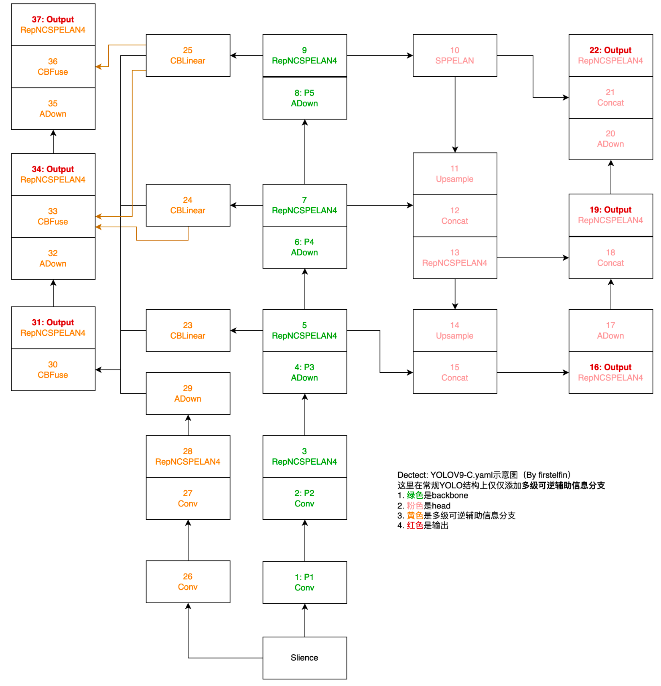

> 注：上图绘制时间较长了，模型可能发生了些许变化，后面的小模块会使用截止20250129的V9项目yaml指定结构名进行说明。

### 4.1 一些基础结构

ADown(目前使用卷积替代)、CBLinear、CBFuse、SPPELAN、RepNCSPELAN4

```mermaid
graph TD
classDef customStyle fill:#f96,stroke:#000,stroke-width:2;
classDef customStyle2 fill:#f233,stroke:#000,stroke-width:2;
subgraph RepBottleneck
 B_input2(Input) --> B_conv1[RepConv1<br/>k1=3]
 B_conv1 --> B_conv2[Conv2<br/>k2=3]
 B_input2 -- shortcut --> B_add[+]
 B_conv2 --> B_add
 B_add --> B_out2(Output)
 class B_input2,B_out2 customStyle
end
subgraph RepCSP:C3
 C3_input3(Input) --> C3_conv1[Conv1]
 C3_input3 --> C3_conv2[Conv2]
 C3_conv1 --> C3_b1[RepBottleneck1<br/>k1=3,k2=3]
 C3_b1 --> C3_b2[RepBottleneck2<br/>k1=3,k2=3]
 C3_b2 -.-> C3_bn[RepBottleneckn<br/>k1=3,k2=3]
 C3_bn --> C3_cat[Cat]
 C3_conv2 --> C3_cat
 C3_cat --> C3_conv3[Conv3]
 C3_conv3 --> C3_out3(Output)
 class C3_input3,C3_out3 customStyle
end
subgraph RepNCSPELAN4
 repncspelan_input(Input) --> repncspelan_chunk[Chunk]
 repncspelan_chunk --> repncspelan_y1(y1)
 repncspelan_chunk --> repncspelan_y2(y2)
 repncspelan_y2 --> repncspelan_repcsp1[Repcsp1]
 repncspelan_repcsp1 --> repncspelan_conv1[Conv1]
 repncspelan_conv1 --> repncspelan_repcsp2[Repcsp2]
 repncspelan_repcsp2 --> repncspelan_conv2[Conv2]
 repncspelan_y1 --> repncspelan_cat[Cat]
 repncspelan_y2 --> repncspelan_cat
 repncspelan_conv1 --> repncspelan_cat
 repncspelan_conv2 --> repncspelan_cat
 repncspelan_cat --> repncspelan_conv3[Conv3<br/>k=1,s=1]
 repncspelan_conv3 --> repncspelan_out(Output)
 class repncspelan_input,repncspelan_out,repncspelan_y1,repncspelan_y2 customStyle
end
subgraph SPPELAN
 sppe_input(Input) --> sppe_conv1[Conv1<br/>k=1,s=1]
 sppe_conv1 --> sppe_maxpool1[MaxPool1<br/>k=5,s=1,p=k//2]
 sppe_maxpool1 --> sppe_maxpool2[MaxPool2<br/>k=5,s=1,p=k//2]
 sppe_maxpool2 --> sppe_maxpool3[MaxPool3<br/>k=5,s=1,p=k//2]
 sppe_conv1 --> sppe_cat[Cat]
 sppe_maxpool1 --> sppe_cat
 sppe_maxpool2 --> sppe_cat
 sppe_maxpool3 --> sppe_cat
 sppe_cat --> sppe_conv2[Conv2<br/>k=1,s=1]
 sppe_conv2 --> sppe_out(Output)
 class sppe_input,sppe_out customStyle
end
subgraph CBFuse
 cbf_input(Input) --index=1--> cbf_x1(X1)
 cbf_input --index=2--> cbf_x2(X2)
 cbf_input --index=n-1--> cbf_xn1(Xn-1)
 cbf_input --index=n--> cbf_xn(Xn)
 cbf_x1 --size=Xn的HW--> cbf_interpolate1[interploate1<br/>mode=nearnest]
 cbf_x2 --size=Xn的HW--> cbf_interpolate2[interploate2<br/>mode=nearnest]
 cbf_xn1 --size=Xn的HW--> cbf_interpolate3[interploaten-1<br/>mode=nearnest]
 cbf_interpolate1 --> cbf_stack[Stack]
 cbf_interpolate2 --> cbf_stack
 cbf_interpolate3 --> cbf_stack
 cbf_xn --> cbf_stack
 cbf_stack --> cbf_sum[Sum<br/>dim=0]
 cbf_sum --> cbf_out(Output)
 class cbf_input,cbf_out,cbf_x1,cbf_x2,cbf_xn,cbf_xn1 customStyle
end
subgraph CBLinear
 cbl_input(Input) --> cbl_conv[Conv<br/>k=1,out_c=sum_c2s]
 cbl_conv --> cbl_split[Split]
 cbl_split --> cbl_out(Output)
 class cbl_input,cbl_out customStyle
end
subgraph ADown
 adown_input(Input) --> adown_avgpool[AvgPool<br/>k=2,s=1]
 adown_avgpool --> adown_chunk[chunk]
 adown_chunk --> adown_x1(x1)
 adown_chunk --> adown_x2(x2)
 adown_x1 --> adown_conv1[Conv1<br/>k=3,s=2]
 adown_x2 --> adown_maxpool[MaxPool<br/>k=3,s=2]
 adown_maxpool --> adown_conv2[Conv2<br/>k=1,s=1]
 adown_conv1 --> adown_cat[Cat]
 adown_conv2 --> adown_cat
 adown_cat --> adown_out(Output)
 class adown_input,adown_out,adown_x1,adown_x2 customStyle
end
```

#### 4.1.1 ADown

特征图下采样模块，目前已经使用卷积代替。操作为先使用核大小为2，步长为1的平均池化，过滤一些噪声，在使用chunk切分为$x1$和$x2$两个张量，$x1$直接使用卷积进行下采样；$x2$使用核大小为3步长为2的最大池化进一步过滤信息，再接一个点卷积融合特征图，最后合并输出。

#### 4.1.2 CBLinear

一个特征图切分模块，先定义需要切分的数量列表$c2s$，定制卷积核数量为$sum(c2s)$，经过卷积后再在通道上按照需求进行切分。CBLinear的输出数量由列表$c2s$元素个数控制，可以参考yo lov9结构图中相应模块的输出箭头数量。

#### 4.1.3 CBFuse

在head部分放缩到制定尺度，然后融合，具体参考yolov9结构图。

### 4.2 v9的主要优化思想

1. **添加可编程梯度信息**（PGI）：主要是解决信息瓶颈，即预测头从目标函数获取反向传播的梯度需要经过非常深的网络传递才能传给backbone部分，所以模型设计了PGI的分支，优化backbone部分各个stage的训练。
2. **广义高效层聚合网络**（GELAN）：这个模块作者主要是优化参数的利用率。在stage层面，模块会先chunk(split)成两部分，一部分进入设计模块RepCSP+Conv两次，再将这两个结构和切分的未处理部分再融合，合并后再经过卷积做信息融合。核心的要义是使用RepConv和部分信道做处理，减少深度卷积因通道数激增带来的计算量，同时有不同层次特征快速融合建模的优点，当然最重要的是参数量也少。实际上这种结构也不少见了。

---

<b><a href="#top">Top</a></b><b>---</b><b><a href="#bottom">Bottom</a></b>

## 5、yolov8 基础模块

ultralytics没有论文介绍V8和V5，所以我们从其配置来简单介绍和之前的模型区别。

V8最主要的结构创新是高效聚合网络C2F，这个与V9的ELAN有点像；在目标函数方面，ultralytics公司引入anchor-free机制，边框的预测由迪克拉预测(单点预测)改为分布预测，即使用DFL损失。其他好像没有什么大的改变，SPPF(Faster SPP)可以勉强算其加入的新结构。SPPF与SPP不同的是，SPPF是不同的池化核大小进行并行输出，同时也串行依序处理。

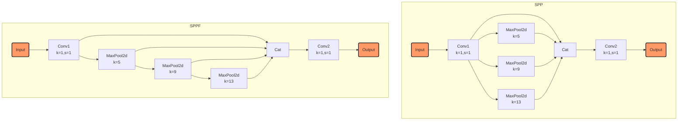

## 6、yolov7 基础模块

和V9、V4有些相似的风格？是的，毕竟相同的作者。

### 6.1 一些基础结构

V7主要使用了高效层聚合网络(ELAN)的改进版本E-ELAN。

```mermaid
graph TD
 classDef customStyle fill:#f96,stroke:#000,stroke-width:2;
 classDef customStyle2 fill:#f233,stroke:#000,stroke-width:2;
 subgraph E-ELAN
  eelan_input(Input) --> eelan_conv1[Conv1<br/>c_in=2c,c_out=2c]
  eelan_conv1 --> eelan_conv2[Conv2<br/>c_in=2c,c_out=2c]
  eelan_conv2 --> eelan_conv3[Conv3<br/>c_in=2c,c_out=2c]
  eelan_conv3 --> eelan_conv4[Conv4<br/>c_in=2c,c_out=2c]
  eelan_conv4 --> eelan_conv5[Conv5<br/>c_in=2c,c_out=2c]
  eelan_input --c_in=c--> eelan_cat_list(CatList1)
  eelan_conv1 --c_in=c--> eelan_cat_list
  eelan_conv3 --c_in=c--> eelan_cat_list
  eelan_conv5 --c_in=c--> eelan_cat_list
  eelan_input -.-> eelan_cat_list2(CatList2)
  eelan_conv1 -.-> eelan_cat_list2
  eelan_conv3 -.-> eelan_cat_list2
  eelan_conv5 -.-> eelan_cat_list2
  eelan_cat_list -- shuffle --> eelan_cat[Cat]
  eelan_cat_list2 -- shuffle --> eelan_cat[Cat]
  eelan_cat --> eelan_conv6[Conv6<br/>k=1,c_in=8c,c_out=2c]
  eelan_conv6 --> eelan_merge[MergeCardinality]
  eelan_merge --> eelan_conv7[Conv7<br/>k=1,c_in=c,c_out=c]
  eelan_conv7 --> eelan_out(Output)
  class eelan_input,eelan_out,eelan_cat_list,eelan_cat_list2 customStyle
 end
 subgraph ELAN
  elan_input(Input) --> elan_conv1[Conv1<br/>c_in=c,c_out=c]
  elan_conv1 --> elan_conv2[Conv2<br/>c_in=c,c_out=c]
  elan_conv2 --> elan_conv3[Conv3<br/>c_in=c,c_out=c]
  elan_conv3 --> elan_conv4[Conv4<br/>c_in=c,c_out=c]
  elan_conv4 --> elan_conv5[Conv5<br/>c_in=c,c_out=c]
  elan_input --> elan_cat[Cat]
  elan_conv1 --> elan_cat
  elan_conv3 --> elan_cat
  elan_conv5 --> elan_cat
  elan_cat --> elan_conv6[Conv6<br/>k=1,c_in=4c,c_out=c]
  elan_conv6 --> elan_out(Output)
  class elan_input,elan_out customStyle
 end
```

ELAN和E-ELAN的结构是根据图示大致绘制，源码ultralytics没有收录，yolov7的博客和项目代码也没有，所以这里只是根据示意图绘制（具体结构可以参考ELAN项目ELANBlock）。

这里结构也代表了检测近几年的一些研究方向：梯度路径优化、特征聚合策略、计算效率提升。

E-ELAN模块将通道数都变为2C，每个带concat的元素都切分为两份，每一个通道数都是C，在用两个容器分别存储所有元素切分的其中一个，shuffle容器内元素，在合并所有元素，实际就是大乱通道的顺序。

### 6.2 基于合并的模型缩放

concat类的结构在执行模型缩放时，合并的数量会变化，导致通道会相应增加或减少，与其他模型结构通道不变是不一样的。这里作者根据这个特点在算深度的时候也考虑了这个问题，让模型保持最有结构。

> 注：这里实际上就是深度参数调参！

### 6.3 免费训练包

#### 6.3.1 参数重构

作者也使用了RepConv，但是没有使用shortcut分支，只有$1 \times 1$和$3 \times 3$卷积分支。

#### 6.3.2 辅助训练模块

这个算比较常规的操作了，很多人魔改的时候应该都会想到，大致是在neck部分直接预测，作为粗预测，精细预测分支(原始预测分支)才是最终推理预测分支。

#### 6.3.3 标签分配器

1. 先导头导向标签分配器：将精细预测与GT比较得到软标签，交给辅助分支预测，相当于将模型变为一个大号的残差结构，辅助分支用于保障召回，精细分支提升精确。
2. 由粗到细的指导标签分配器：允许更多的预测成为正样本实例，保障召回。

---

其他版本可以直接查阅在线博客，暂停更新！

---

<b><a href="#top">Top</a></b><b>---</b><b><a href="#bottom">Bottom</a></b>

**参考资源**:

1. [graph绘制](https://www.jianshu.com/p/b421cc723da5)
2. [markdown依赖](https://myst-parser.readthedocs.io/en/latest/index.html)
3. [mermaid依赖](https://github.com/mgaitan/sphinxcontrib-mermaid?tab=readme-ov-file)
4. [mermaid官网](https://mermaid.js.org/intro/getting-started.html)
5. [yolov9博客介绍](https://blog.csdn.net/weixin_43334693/article/details/136383022)
6. [yolov7 博客](https://blog.csdn.net/weixin_43334693/article/details/130478338)

<b>完！</b>

<!-- markdownlint-enable MD033 -->
