    
<h1>YOLO系列模型速览--V1～V11</h1>

	 
    

        <b>作者：</b><b>elfin</b>&nbsp;&nbsp;
        <b>资料来源：<a href="https://github.com/ultralytics/ultralytics/blob/main/ultralytics/nn/modules/block.py">ultralytics</a></b>
	

[toc]

# 1、YOLOv11 基础模块

---

V11的创新主要是：C3K2和C2PSA，详情如下。

## 1.1 C3K2结构详细说明

相关结构示意图：

```mermaid
graph TD
  classDef customStyle fill:#f96,stroke:#000,stroke-width:2;
  classDef customStyle2 fill:#f233,stroke:#000,stroke-width:2;
  subgraph C3K2
  C3K2_input(Input) --> C3K2_conv1[Conv1]
  C3K2_conv1 --> C3K2_chunk[Chunk]
  C3K2_chunk --> C3K2_cat[Cat]
  C3K2_chunk --> C3K2_b1[C3K_1<br/>n=2]
  C3K2_b1 --> C3K2_b2[C3K_2<br/>n=2]
  C3K2_b2 -.-> C3K2_bn[C3K_n<br/>n=2]
  C3K2_bn --> C3K2_cat
  C3K2_b1 --> C3K2_cat
  C3K2_b2 --> C3K2_cat
  C3K2_cat --> C3K2_conv2[Conv2]
  C3K2_conv2 --> C3K2_out(Output)
  class C3K2_input,C3K2_out customStyle
  end
  subgraph C3K
  C3K_input3(Input) --> C3K_conv1[Conv1]
  C3K_input3 --> C3K_conv2[Conv2]
  C3K_conv1 --> C3K_b1[Bottleneck1<br/>k1=3,k2=3]
  C3K_b1 --> C3K_b2[Bottleneck2<br/>k1=3,k2=3]
  C3K_b2 -.-> C3K_bn[Bottleneckn<br/>k1=3,k2=3]
  C3K_bn --> C3K_cat[Cat]
  C3K_conv2 --> C3K_cat
  C3K_cat --> C3K_conv3[Conv3]
  C3K_conv3 --> C3K_out3(Output)
  class C3K_input3,C3K_out3 customStyle
  end
  subgraph C3
  C3_input3(Input) --> C3_conv1[Conv1]
  C3_input3 --> C3_conv2[Conv2]
  C3_conv1 --> C3_b1[Bottleneck1<br/>k1=1,k2=3]
  C3_b1 --> C3_b2[Bottleneck2<br/>k1=1,k2=3]
  C3_b2 -.-> C3_bn[Bottleneckn<br/>k1=1,k2=3]
  C3_bn --> C3_cat[Cat]
  C3_conv2 --> C3_cat
  C3_cat --> C3_conv3[Conv3]
  C3_conv3 --> C3_out3(Output)
  class C3_input3,C3_out3 customStyle
  end
  subgraph c2f
  input(Input) --> conv1[Conv1]
  conv1 --> chunk[Chunk]
  chunk --> cat[Cat]
  chunk --> b1[Bottleneck1<br/>k1=3,k2=3]
  b1 --> b2[Bottleneck2<br/>k1=3,k2=3]
  b2 -.-> bn[Bottleneckn<br/>k1=3,k2=3]
  bn --> cat
  b1 --> cat
  b2 --> cat
  cat --> conv2[Conv2]
  conv2 --> out(Output)
  class input,out customStyle
  end
  subgraph C2
  C2_input3(Input) --> C2_conv1[Conv1]
  C2_conv1 --> C2_chunk[chunk]
  C2_chunk --> C2_b1[Bottleneck1<br/>k1=3,k2=3]
  C2_b1 --> C2_b2[Bottleneck2<br/>k1=3,k2=3]
  C2_b2 -.-> C2_bn[Bottleneckn<br/>k1=3,k2=3]
  C2_bn --> C2_cat[Cat]
  C2_chunk --> C2_cat
  C2_cat --> C2_conv3[Conv2]
  C2_conv3 --> C2_out3(Output)
  class C2_input3,C2_out3 customStyle
  end
  subgraph Bottleneck
  B_input2(Input) --> B_conv1[Conv1<br/>k1=3]
  B_conv1 --> B_conv2[Conv2<br/>k2=3]
  B_input2 -- shortcut --> B_add[+]
  B_conv2 --> B_add
  B_add --> B_out2(Output)
  class B_input2,B_out2 customStyle
  end
```

结构说明：

1. Bottleneck：主分支默认conv1(kernel_size=3), conv2(kernel_size=3), shortcut分支是默认开启的，也可以关闭;
2. c2f: 在C2的结构基础上，修改了hidden_channel的大小，Cat操作时将所有Bottleneck的输出都纳入了合并操作，F的含义是Faster;
3. C3: 和C2类似，只是在“shortcut”分支上使用了一个卷积，C2是没有的, C3和C2另一个差异是Bottleneck的第一个卷积卷积核大小修改为1了, 更多差异见结构图;
4. C3K: 在C3的基础上修改了Bottleneck的kernel_size参数，C3默认是kernel_size=[[1, 1], [3, 3]], 修改为kernel_size=[3, 3];
5. C3K2: 使用c2f结构，替换Bottleneck为C3K结构，C3K结构的Bottleneck重复次数为2(即n=2)

---

## 1.2 C2PSA 位置敏感注意力

相关结构示意图如下：

```mermaid
graph TD
  classDef customStyle fill:#f96,stroke:#000,stroke-width:2;
  classDef customStyle2 fill:#f233,stroke:#000,stroke-width:2;
  subgraph C2PSA
  C2_input3(Input) --> C2_conv1[Conv1]
  C2_conv1 --> C2_chunk[Split]
  C2_chunk --> C2_b1[PSABlock1]
  C2_b1 --> C2_b2[PSABlock2]
  C2_b2 -.-> C2_bn[PSABlockn]
  C2_bn --> C2_cat[Cat]
  C2_chunk --> C2_cat
  C2_cat --> C2_conv3[Conv2]
  C2_conv3 --> C2_out3(Output)
  class C2_input3,C2_out3 customStyle
  end
  subgraph PSABlock
  psablock_input(Input) --> attention[Attention]
  attention --> psablock_add[+]
  psablock_add --> psablock_x(x)
  psablock_input --shortcut--> psablock_add
  psablock_x --> psablock_ffn_conv1[ffn_conv1]
  psablock_ffn_conv1 --> psablock_ffn_conv2[ffn_conv2]
  psablock_ffn_conv2 --> psablock_add2[+]
  psablock_x --shortcut--> psablock_add2
  psablock_add2 --> psablock_out(Output)
  class psablock_input,psablock_out,psablock_x customStyle
  end
  subgraph PSA
  psa_input(Input) --> psa_conv1[Conv1]
  psa_conv1 --> psa_split[Split]
  psa_split --> a(a) --> psa_cat[Cat]
  psa_split --> b(b) --> psa_atten[Attention]
  psa_atten --> psa_add1[+]
  b --> psa_add1
  psa_add1 --> psa_add2[+]
  psa_add1 --> ffn_conv1[ffn_conv1]
  ffn_conv1 --> ffn_conv2[ffn_conv2]
  ffn_conv2 --> psa_add2
  psa_add2 --> psa_cat
  psa_cat --> psa_conv2[Conv2]
  psa_conv2 --> psa_out[OutPut]
  class psa_input,psa_out,a,b customStyle
  end
  subgraph Attention
  attn_input(Input) --> qkv_conv[QKV_Conv]
  qkv_conv -- view --> split[Split<br/>key_dim, key_dim, head_dim]
  split --> Q(Q)
  split --> K(K)
  split --> V(V)
  Q --> QK[Q x K]
  K --> QK
  QK -- scale --> softmax[Softmax]
  softmax --> out_attn(attn)
  V --reshape--> attn_pe[pe Conv]
  out_attn --> attn_attnxv[V x attn]
  V --> attn_attnxv
  attn_attnxv --view--> attn_add[+]
  attn_pe --> attn_add
  attn_add --> attn_proj[proj Conv]
  attn_proj --> attn_out(Output)
  class attn_input,attn_out,Q,K,V,out_x,out_attn customStyle
  end
  
```

结构说明：

### 1.2.1 Attention

**Step1**: 注意力模块，使用一个qkv_conv卷积，生成Q、K、V张量；输入维度为dim，每个注意力头需要的维度为`dim // head_num`，这个数值就是V张量的信道维度head_dim；设置K张量和Q张量每个head的通道数量为key_dim；qkv_conv输出的通道数量为`head_num * (2*key_dim + head_dim)`；

**Step2**: Q张量转置与K张量进行矩阵乘法，矩阵乘法的shape变化：`Q_shape=[B, head_num, key_dim, H*W]`，`K_shape=[B,head_num, key_dim, H*W]`，$Q^{T}K$的shape为`[B, head_num, H*W, H*W]`，先对$Q^{T}K$放缩，再对$Q^{T}K$在最后一个轴应用softmax得到`attn`注意力特征图；

**Step3**: attn注意力特征图和V张量进行矩阵乘法，矩阵乘法的shape变化：`V_shape=[B, head_num, head_dim, H*W]`，$V@attn$的shape为`[B, head_num, head_dim, H*W]`，最后还原shape为`[B, C, H, W]`。

**Step4**: 还原V张量shape为`[B, C, H, W]`，使用卷积生成偏置，并将结果与step3的输出相加。

**Step5**: 使用投影卷积对特征空间做线性变换。

### 1.2.2 PSABlock PSA基础模块

**Step1**: 输入接入Attention模块，结果和shortcut分支相加；

**Step2**: step1输出结果经过两个前馈卷积处理，再和shortcut分支相加。

### 1.2.3 PSA 位置敏感注意力机制

**Step1**: 输入接入卷积，卷积输出切分为两个张量a和b；

**Step2**: b张量使用PSABlock处理，合并结果和a张量；

**Step3**: 接入卷积整合不同层级的特征图。

### 1.2.4 C2PSA

C2PSA模块是使用C2的结构，替换C2中的Bottleneck模块为PSABlock模块。

---

    <b><a href="#top">Top</a></b>
	&nbsp;<b>---</b>&nbsp;
	<b><a href="#bottom">Bottom</a></b>

# 2、YOLOv10 基础模块

---

创新点：

1. **引入C2FCIB结构**：在backbone和neck部分引入了C2FCIB结构，当然不是全部替换V8的C2F结构，作者只应用在backbone和neck的P4、P5部分。
2. **一对一预测分支**：常规的目标检测（DETR是无NMS的）是多对一检测，即使用目标放缩后的格子极其周边格子一起预测这个实例，一个格子往往会生成多个预测；V10在保留这个分支的同时，添加了一个一对一分支，这个分支直接输出最终对应的预测，避免了NMS。

> 注：3年前，我也手搓过这个一对一的分支，当时模型不收敛，对比V10可能就是没有使用多对一分支，导致模型很难学习。

## 2.1 C2FCIB

C2FCIB是使用CIB结构替换了C2F模块中的Bottleneck结构。

```mermaid
graph TD
  classDef customStyle fill:#f96,stroke:#000,stroke-width:2;
  classDef customStyle2 fill:#f233,stroke:#000,stroke-width:2;
  subgraph RepVGGDW
    repvggdw_input(Inout) --> repvggdw_conv[Conv<br/>k=7,s=1,p=3]
    repvggdw_conv --> repvggdw_add[+]
    repvggdw_input --train=True--> repvggdw_conv1[Conv1<br/>k=3,s=1,p=1]
    repvggdw_conv1 --> repvggdw_add
    repvggdw_add --> repvggdw_act[nn.SiLU]
    repvggdw_act --> repvggdw_out(Output)
    class repvggdw_input,repvggdw_out customStyle
  end
  subgraph CIB
    cib_input(Input) --> cib_conv1[Conv1<br/>k=3,g=c_in]
    cib_conv1 --> cib_conv2[Conv2<br/>k=1]
    cib_conv2 --lk=True--> cib_RepVGGDW1[RepVGGDW]
    cib_conv2 --lk=False--> cib_RepVGGDW2[Conv<br/>k=3,g=c_in]
    cib_RepVGGDW1 --> cib_conv3[Conv3<br/>k=1]
    cib_RepVGGDW2 --> cib_conv3
    cib_conv3 --> cib_conv4[Conv4<br/>k=3,g=c_in]
    cib_conv4 --> cib_add[+]
    cib_input --shortcut=True--> cib_add
    cib_add --> cib_out(Output)
    class cib_input,cib_out customStyle
  end
  subgraph C2FCIB
    c2fcib_input(Input) --> conv1[Conv1]
    conv1 --> chunk[Chunk]
    chunk --> cat[Cat]
    chunk --> b1[CIB]
    b1 --> b2[CIB]
    b2 -.-> bn[CIB]
    bn --> cat
    b1 --> cat
    b2 --> cat
    cat --> conv2[Conv2]
    conv2 --> out(Output)
    class c2fcib_input,out customStyle
  end
  
```

### 2.1.1 CIB

CIB：Conditional Identity Block

1. lk参数配置是否使用RepVGGDW
2. Conv1: 卷积核大小为3，分组数就是通道数
3. Conv2: 卷积核大小为1，融合所有通道特征
4. Conv3, Conv4类似

CIB就是深度卷积核点卷积的叠加模块，lk控制是否使用RepVGGDW模块。因此本质上，CIB是三个模块，第一个模块是深度卷积与点卷积、第二个是参数重构模块、第三个是点卷积和深度卷积。

### 2.1.2 C2FCIB

如上图所示，这里将C2F中的Bottleneck替换为CIB，模型结构上更复杂，但是参数量却减少了，特征学习更精细。

---

    <b><a href="#top">Top</a></b>
	&nbsp;<b>---</b>&nbsp;
	<b><a href="#bottom">Bottom</a></b>

# 3、YOLOv9 基础模块

---

    <b><a href="#top">Top</a></b>
	&nbsp;<b>---</b>&nbsp;
	<b><a href="#bottom">Bottom</a></b>

    <b>完！</b>

# 参考资源：

1. [graph绘制](https://www.jianshu.com/p/b421cc723da5)
