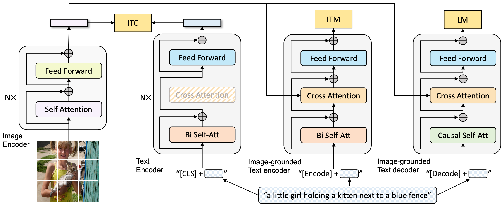

## BLIP系列

> 多模态综述：https://arxiv.org/pdf/2306.13549
> 多模态综述项目：https://github.com/BradyFU/Awesome-Multimodal-Large-Language-Models?tab=readme-ov-file

### BLIPv1

> BLIP论文：https://arxiv.org/abs/2201.12086
> BLIP项目：https://github.com/salesforce/BLIP

boosting这个词很久没有看见了，复查了周志华老师的机器学习，boosting是包含于**集成学习**(ensembleLearning)。这类算法的工作机制是：先从初始训练集训练出一个基学习器，再根据基学习器的表现对训练样本分布调整，使得先前基学习器做错的训练样本在后续受到更多关注，然后基于调整后的样本分布来训练下一个基学习器；如此重复进行，直至基学习器数目达到事先指定的值T，最终将这T个基学习器进行加权结合。（摘自《机器学习》）

论文的基学习器：

> 1. 右边的编解码同色的block是参数共享的
> 2. 多模态混合，这是一个统一的视觉-语言模型，它可以在以下三个功能之一中运行
>    a. **ITC**: 单模态编码器, 使用图像-文本对比（ITC）损失进行训练，以对齐视觉和语言表示
>    b. **ITM**: 基于图像的文本编码器使用额外的交叉注意层来模拟视觉-语言交互，并使用图像-文本匹配（ITM）损失进行训练以区分正负图像-文本对(判别是否是图文配对)
>    c. **LM**: 基于图像的文本解码器, 用因果自注意层替换双向自注意层，并与编码器共享相同的交叉注意层和前馈网络。 解码器使用语言建模（LM）损失进行训练，以根据图像生成字幕

