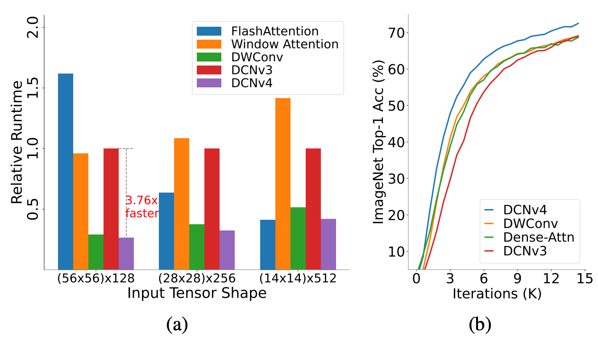

## DCN 系列改进

### DCN v1

首次(2017)将动态形变引入卷积，显著提升了模型对复杂形变的适应能力，尤其适用于目标检测和语义分割任务。在标准卷积的规则采样网格中引入可学习的偏移量（offset），使卷积核能够自适应目标的几何形变（如旋转、缩放、非刚体形变等）。

$$
y(p_{0}) = \sum_{k=1}^{K} {W_{k} X(p_{0} + p_{k} + \Delta p_{k})}
$$

实现方式：

- 通过一个额外的卷积分支预测每个采样点的偏移量（2K个通道，K为卷积核大小）。

- 使用双线性插值计算偏移后的非整数位置特征值，确保梯度可反向传播。

---

### DCN v2

DCN v1 存在偏移量的预测存在一定的误差，导致预测的偏移量与真实偏移量之间存在较大的差距，常出现偏移出目标。DCN v2(2018)提出了采样点的动态调制，实现对不同采样点的加权。

$$
y(p_{0}) = \sum_{k=1}^{K} {W_{k} X(p_{0} + p_{k} + \Delta p_{k})} M_{k}
$$

改进点：

- 调制机制（Modulation）：在偏移基础上引入调制标量（modulation scalar），为每个采样点赋予权重，进一步控制特征提取的强度。
- 更灵活的偏移范围：通过调整偏移量的学习方式，支持更大的形变范围。

实现细节：

- 新增一个卷积分支预测调制标量（K个通道），并通过Sigmoid函数约束其范围。
- 偏移量与调制标量结合，形成“偏移+加权”的复合操作。

---

### DCN v3

DCNv3(2023)引入卷积神经元的权重共享; 分组机制(多头机制类似); 采样点归一化调制标量。

项目：<https://github.com/OpenGVLab/InternImage>

论文：<https://arxiv.org/pdf/2211.05778>

$$
y(p_{0}) = \sum_{g=1}^{G} \sum_{k=1}^{K} {W_{g} X_{g}(p_{0} + p_{k} + \Delta p_{gk})} M_{gk}
$$

改进点：

- **引入卷积神经元的权重共享**    深度卷积(分组卷积) + 点卷积(组内共享参数), 所以$W_{g}$可以共享, 与$k$无关。
- **分组机制**    将卷积核分为多个组，每个组实现V1中的偏移和V2中的调制机制，提升模型的鲁棒性。
- **采样点归一化调制标量**    在采样点维度上将调制标量归一化到[0,1]，使得不同采样点的权重相对一致, 增强模型的梯度的稳定性。

V3也尝试给出了使用它的扩展结构。

---

### DCN v4

论文：<https://arxiv.org/pdf/2401.06197>

项目：<https://github.com/OpenGVLab/DCNv4>

如上图所示，DCNv4 layer和深度可分离卷积的执行效率接近，甚至在多个shape上有轻微领先; 在对应的模型中，DCN也是最容易收敛且性能轻微领先的结构。

DCNv3存在的问题：访存(MAC)的开销太大啦
1. flash-attention: FLOP(浮点运算量)很大，但是访存却很小，所以也实现了较高的运行速度；
2. DCN: 深度可分离卷积，其计算成本和DWConv相似，但是MAC开销很大。

为了解决这些问题，作者提出啦一下策略。

#### 取消Softmax算子

softmax算子限制了动态范围，使得表征能力变弱。作者使用ConvNeXt对深度卷积权重进行sofmax操作，直接导致收敛速度变慢。实验表明CNN和DCN这种窗口聚合的算子，使用无界的动态范围比使用归一化的权重更好，收敛更快。

因为，基于窗口的注意力：

$$
\text{atten}=\text{Softmax}\left( \frac{QK^{T}}{\sqrt{d}} \right) \cdot V
$$

每一个采样点是从Q和K对应的位置通过大小为d的嵌入向量相乘得到伪注意力特征，本身没有聚合周边的采样点，没有softmax从公式就能看出模型退化为线性变换了，这样就没有实现特征提取的作用。

#### 降低访存压力

常规CNN算子：输入输出访存计算为 $2HWC$。

DCNv3的访存：输入输出访存计算为 $2HWC$，偏移量 $2\times 9 HWG = 18HWG$，调制量的访存计算量为 $9HWG$。假设 $G=16$，即有16个分组，那么DCNv3差不多是 $3.6875HWC$。这个实际是按照理想情况计算的，是在无限缓存、并行处理的环境中考虑的。如果不考虑缓存和并行，所有线程束的线程都会获取自己所需的张量，DCNv3需要两次双线性插值，包含 $4\times9 HWC =36HWC$，27次偏移和调制张量读取量 $27HWC$。加上一次写入操作，理论上的MAC量是 $64HWC$，大约是理想情况的17.36倍。

优化点：

1. **同一组内同一个采样点的偏移是一样的** 同一组内有 $D$个通道，这些通道的偏移是一致的，因此每个输出位置上使用一个线程处理同一组内的多个通道可以消除这些冗余的内存读取请求，从而大大减少内存带宽的使用。因为位置相同，所以DCN中双线性插值的系数也只计算一次，让组内共用。理论上访存和双线性插值系数计算陈本降低 $D^{\prime}$倍。这是一个线程同时处理 $D^{\prime}$个通道，这会导致并行度降低。因为DCN的计算量比较低，双线性插值只需要为所有 $D^{\prime}$通道执行一次，所以大部分工作负载是从不同通道读取输入值的内存指令。
2. **指令加速** 要从内存中读取四个32位浮点值，不是使用四条指令四次读取一个32位浮点值，我们可以使用单一指令一次性加载一个128位打包值，从而减少指令数量和每个线程的执行时间。在写入GPU内存时也使用类似技术，最小化内存访问时间并增加带宽利用率。

每一个采样点是从Q和K对应的位置通过大小为d的嵌入向量相乘得到伪注意力特征，本身没有聚合周边的采样点，没有softmax从公式就能看出模型退化为线性变换了，这样就没有实现特征提取的作用。但是DCN和CNN这种结构本身是融合了周边采样点的信息的，每个窗口都不一样，从理论和实验表明softmax是非必要操作。
取消sofmax有效提升了模型的动态表达能力。这一改变使DCNv4的收敛速度优于其他模型。

