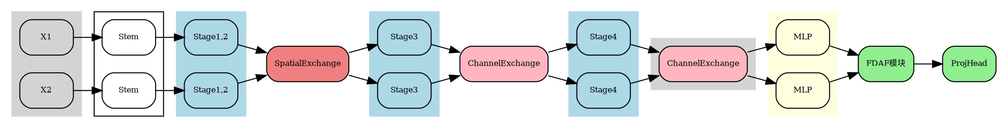

# changer-ex

changer-ex模型的架构图如下所示：

```dot
digraph ChangerEx {
    rankdir=LR; // 设置布局方向为从上到下
    ranksep=0.4;
    node [shape=box, style="rounded", fontsize=8]; // 定义节点样式
    //node [shape=box, style="rounded", width=1.5, height=0.6]; // 定义节点样式
    edge [arrowhead=normal];

    // 为不同模块定义子图（Subgraph），使结构更清晰
    subgraph cluster_input {
        style=filled;
        color=lightgrey;
        X1 [label="X1"];
        X2 [label="X2"];
    }

    subgraph cluster_Stem_encoder {
        Stem1 [label="Stem"];
        Stem2 [label="Stem"];
    }

    subgraph cluster_encoder1 {
        style=filled;
        color=lightblue;
        // 编码器的四个阶段
        S11 [label="Stage1,2"];
        S21 [label="Stage1,2"];
    }

    subgraph cluster_encoder2 {
        style=filled;
        color=lightblue;
        S13 [label="Stage3"];
        S23 [label="Stage3"];
    }

    subgraph cluster_encoder3 {
        style=filled;
        color=lightyellow;
        MLP1 [label="MLP"];
        MLP2 [label="MLP"];
    }
    subgraph cluster_decoder1 {
        style=filled;
        color=lightblue;
        S14 [label="Stage4"];
        S24 [label="Stage4"];
    }

    subgraph cluster_exchange1 {
        style=filled;
        color=none;
        // 不同阶段对应的交换操作
        SPATIAL_EXCHANGE [label="SpatialExchange", shape=box, style="rounded,filled", fillcolor=lightcoral];
    }

    subgraph cluster_exchange2 {
        style=filled;
        color=none;
        // 不同阶段对应的交换操作
        CHANNEL_EXCHANGE1 [label="ChannelExchange", shape=box, style="rounded,filled", fillcolor=lightpink];
    }

    subgraph cluster_exchange3 {
        style=filled;
        color=lightgrey;
        // 不同阶段对应的交换操作
        CHANNEL_EXCHANGE2 [label="ChannelExchange", shape=box, style="rounded,filled", fillcolor=lightpink];
    }

    // 融合与解码模块
    FDAF [label="FDAF模块", shape=box, style="rounded,filled", fillcolor=lightgreen];
    HEAD [label="ProjHead", shape=box, style="rounded,filled", fillcolor=lightgreen];

    // --- 定义流程连接 ---
    // 输入到编码器
    X1 -> Stem1 [style=solid, dir=forward];
    X2 -> Stem2 [style=solid, dir=forward];
    Stem1 -> S11 [style=solid, dir=forward];
    Stem2 -> S21 [style=solid, dir=forward];
    //S11 -> S12 [style=solid, dir=forward];
    //S21 -> S22 [style=solid, dir=forward];
    S11 -> SPATIAL_EXCHANGE [style=solid, dir=forward];
    S21 -> SPATIAL_EXCHANGE [style=solid, dir=forward];
    SPATIAL_EXCHANGE -> S13 [style=solid, dir=forward];
    SPATIAL_EXCHANGE -> S23 [style=solid, dir=forward];
    S13 -> CHANNEL_EXCHANGE1 [style=solid, dir=forward];
    S23 -> CHANNEL_EXCHANGE1 [style=solid, dir=forward];
    CHANNEL_EXCHANGE1 -> S14 [style=solid, dir=forward];
    CHANNEL_EXCHANGE1 -> S24 [style=solid, dir=forward];
    S14 -> CHANNEL_EXCHANGE2 [style=solid, dir=forward];
    S24 -> CHANNEL_EXCHANGE2 [style=solid, dir=forward];
    CHANNEL_EXCHANGE2 -> MLP1 [style=solid, dir=forward];
    CHANNEL_EXCHANGE2 -> MLP2 [style=solid, dir=forward];
    MLP1 -> FDAF [style=solid, dir=forward];
    MLP2 -> FDAF [style=solid, dir=forward];
    FDAF -> HEAD [style=solid, dir=forward];
    
}
```

---
