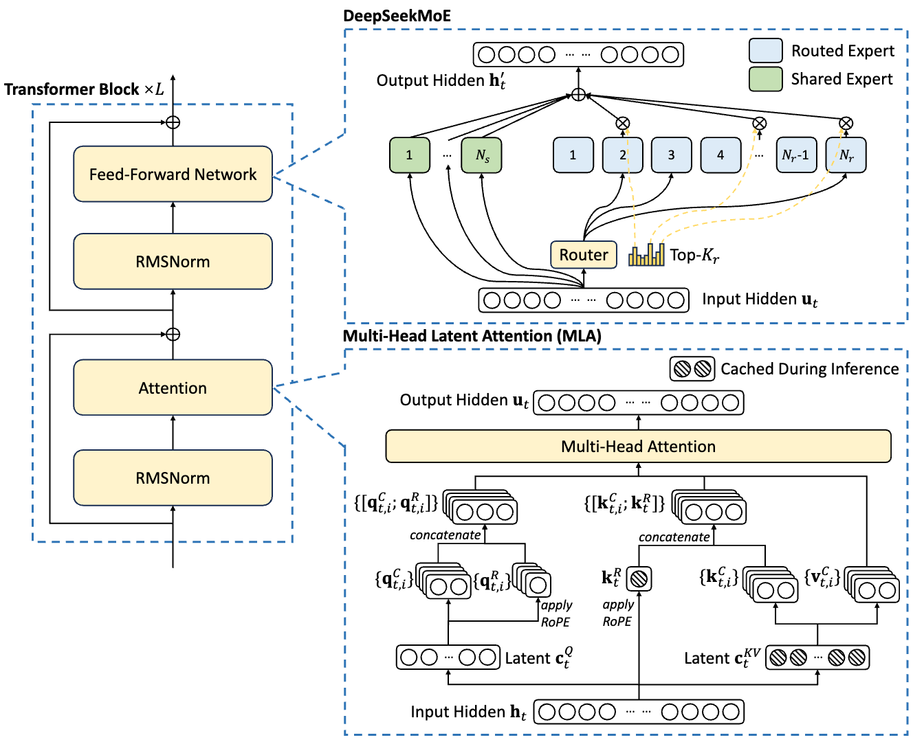
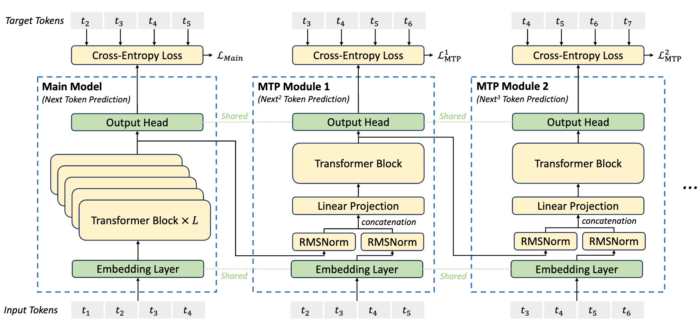
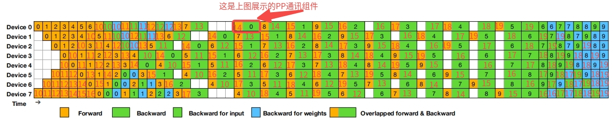
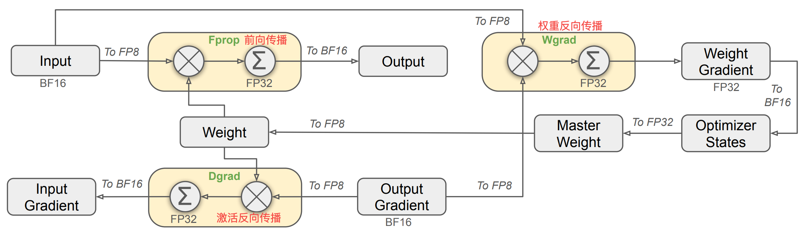
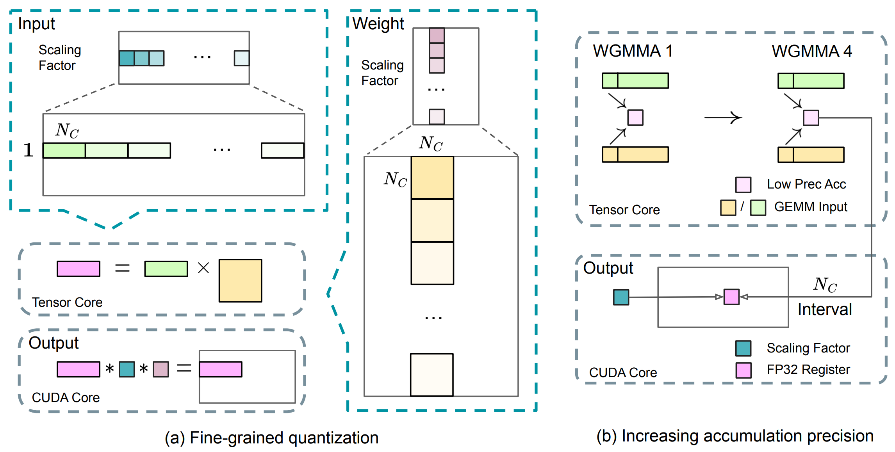

  
<h1>deepseek系列速览</h1>

	 
    

        <b>作者：</b><b>elfin</b>  
        <b>资料来源：<a href="https://github.com/deepseek-ai/DeepSeek-V3/blob/main/DeepSeek_V3.pdf">deepseek</a></b>
	

[toc]

---

## 1、deepseek-v3

    <b><a href="#top">Top</a></b>
	 <b>---</b> 
	<b><a href="#bottom">Bottom</a></b>

DeepSeek-V3模型是一个**混合专家模型(MoE)**，总共671B的参数，对于每一个token只激活37B。为了实现高效推理和训练，DeepSeek-V3采用了 **多头潜在注意力(Multi-head Latent Attention: MLA)** 和DeepSeekMoE架构，这些在DeepSeek-V2中已经验证过。针对负载平衡和多标签预测训练目标，DeepSeek-V3提出了辅助无损策略。

**结构创新点**：

1. 除DeepSeek-V2 的高效架构之外，我们还开创了一种用于负载均衡的**辅助无损策略**，该策略可以最大限度地减少因鼓励负载均衡而引起的性能下降。
2. 我们研究了多标记预测 （MTP） 目标，并证明它对模型性能有益。它还可用于推理加速的推测解码。

**训练前的创新点**：

1. 设计FP8 混合精度训练框架，并首次在超大规模模型上验证了 FP8 训练的可行性和有效性。
2. 通过算法、框架和硬件的协同设计，我们克服了跨节点 MoE 训练中的通信瓶颈，实现了近乎全的计算通信重叠。这显著提高了我们的训练效率并降低了训练成本，使我们能够在不增加开销的情况下进一步扩大模型大小。

**DeepSeek-R1 的知识提炼**：

1. 我们引入了一种创新的方法，将 longChain-of-Thought （CoT） 模型的推理能力提炼出来，特别是从 DeepSeek-R1 系列模型提炼到标准LLMs模型中，特别是 DeepSeek-V3。我们的管道优雅地整合了将 R1 的验证和反射模式引入 DeepSeek-V3，并显著提高其推理性能。同时，我们还保持对 DeepSeek-V3 的输出样式和长度的控制。

---

    <b><a href="#top">Top</a></b>
	 <b>---</b> 
	<b><a href="#bottom">Bottom</a></b>

### 1.1 MLA: Multi-head Latent Attention

#### 1.1.1 K和V的通道降维

MLA 的核心是对注意力键和值的低秩联合压缩，以减少推理过程中的键值 （KV） 缓存:

$$
\begin{align}
\textcolor{blue}{C_{t}^{KV}} &= W^{DKV} h_{t},\qquad C_{t}^{KV} \in \mathbb{R}^{d_{c}},\quad h_{t} \in \mathbb{R}^{d_{h}},\quad W^{DKV} \in \mathbb{R}^{d_{c} \times d} \\
K_{t}^{C} = [ K_{t,1}^{C}, K_{t,2}^{C}, \dots, K_{t,n_{h}}^{C} ] &= W^{UK} C_{t}^{KV}, \qquad W^{UK} \in \mathbb{R}^{d_{h}n_{h} \times d_{c}} \\
\textcolor{blue}{K_{t}^{R}} &= \textcolor{green}{RoPE}( W^{KR} h_{t}), \qquad W^{KR} \in \mathbb{R}^{d_{h}^{R} \times d} \\
K_{t,i} &= \textcolor{green}{Cat}([K_{t,i}, K_{t}^{R}]) \\
V_{t}^{C} = [ V_{t,1}^{C}, V_{t,2}^{C}, \dots, V_{t,n_{h}}^{C} ] &= W^{UV} C_{t}^{KV}, \qquad W^{UV} \in \mathbb{R}^{d_{h}n_{h} \times d_{c}}
\end{align}
$$

- 这里的$W^{DKV}, W^{UK}, W^{UV}, W^{KR}$都是全连接算子的权重。
- 这里的$C$是compressed，意为压缩，即将$h_{t}$的通道压缩，使得$d_c \ll d_{h} * n_{h}$，其中$h_{t}$是标识第$t$个token的注意力输入，其通道数量是$d_{h}$，head的数量为$n_{h}$。
- $W^{KR}$是用于产生解耦的旋转位置编码(RoPE)的矩阵。
- $W^{UK}, W^{UV}$都是升维的矩阵。
- $Cat$是合并操作(绿色表示算子)。
- 上述蓝色张量是压缩过通道的，且需要缓存的，这可以让我们的缓存压力骤减，同时不影响识别效果(和多头注意力MHA相比)。

#### 1.1.2 Query的通道降维

和Key、Value一样，作者也进行通道的压缩，以降低缓存压力。

$$
\begin{align}
C_{t}^{Q} &= W^{DQ} h_{t},\qquad C_{t}^{Q} \in \mathbb{R}^{d_{c}^{\prime}}, \quad W^{DQ} \in \mathbb{R}^{d_{c}^{\prime} \times d} \\
Q_{t}^{C} = [ Q_{t,1}^{C}, Q_{t,2}^{C}, \dots, Q_{t,n_{h}}^{C} ] &= W^{UQ} C_{t}^{Q}, \qquad W^{UQ} \in \mathbb{R}^{d_{h}n_{h} \times d_{c}^{\prime}}  \\
Q_{t}^{R} = [Q_{t,1}^{R}, Q_{t,2}^{R}, \dots, Q_{t,n_{h}}^{R} ] &= \textcolor{green}{RoPE}( W^{QR} C_{t}^{Q}), \qquad W^{DQ} \in \mathbb{R}^{d_{h}n_{h} \times d_{c}^{\prime}}  \\
Q_{t,i} &= \textcolor{green}{Cat}([Q_{t}^{C}, Q_{t,i}^{R}])
\end{align}
$$

- $C_{t}^{Q}$是Query的压缩后潜在张量。
- $W^{QR}$是用于解耦生成RoPE的矩阵。

#### 1.1.3 MLA注意力

如1.1.1中定义的**键**$K_{j,i}$，**值**$V_{j,i}^{C}$，1.1.2中的**查询**$Q_{t,i}$，$i$标记了head的索引。

$$
\begin{align}
O_{t,i} &= \Sigma_{j=1}^{t}Softmax_{j}(\frac{Q_{t,i}^{T} \times K_{j,i}}{\sqrt{d_{h} + d_{h}^{R}}}) \times V_{j,i}^{C} \\
U_{t} &= W^{O} \times Cat([O_{t,1}, O_{t,2}, \dots, O_{t,n_{h}}])
\end{align}
$$

- $Cat$是合并所有头的特征。
- $W^{O}$是全连接映射权重，融合不同head的特征。

公式和MHA并没有实质差异，其关键区别还是在1.1.1和1.1.2，简述：

1. Query：先使用$W^{DQ}$进行通道降维，得到潜在Query表示，最后使用$W^{UQ}$进行升维，添加旋转位置编码(由潜在Query得到)，得到最后的Query；
2. Value：先使用$W^{DKV}$进行通道降维，得到潜在Value和Key的表示，最后使用$W^{UV}$进行升维，得到最后的Value；
3. Key：先使用$W^{DKV}$进行通道降维，得到潜在Value和Key的表示，最后使用$W^{UK}$进行升维，添加旋转位置编码(由输入$h_{t}$得到)，得到最后的Key；

> 注：上标的D表示降维，U表示升维

以上，总结就是QKV都存中间潜在特征，使用时使用维度还原矩阵相应还原，Key和Value在计算前还添加了位置编码，其余操作和MHA相似。

---

    <b><a href="#top">Top</a></b>
	 <b>---</b> 
	<b><a href="#bottom">Bottom</a></b>

### 1.2 具有辅助无损负载均衡的DeepSeekMoE

> 图中的列表内分号表示Cat操作！

#### 1.2.1 DeepSeekMoE结构

在前馈神经网络(FFN)中，DeepSeek-V3采用了DeepSeekMoE结构。与传统的MoE结构(Shard)相比，DeepSeekMoE 使用更细粒度的专家，并将一些专家隔离为共享专家。令$U_{t}$表示第$t$个token的FFN输入，FFN的输出$h_{t}^{\prime}$可以如下表示：

$$
\begin{align}
h_{t}^{\prime} &= U_{t} + \Sigma_{i=1}^{N_{s}}{FFN_{i}^{(s)}(U_{t})} + \Sigma_{i=1}^{N_{r}}{g_{i,t}FFN_{i}^{(r)}(U_{t})} \\
g_{i,t} &= \frac{g_{i,t}^{\prime}}{\Sigma_{j=1}^{N_{r}}{g_{j,t}^{\prime}}} \\
g_{i,t}^{\prime} &= \begin{cases}
s_{i,t} \quad &s_{i,t} \in \text{TopK}(\left \{ s_{j,t} \mid 1 \le j \le N_{r} \right \}, K_{r})   \\ 
0, \quad & \text{otherwise}
\end{cases} \\
s_{i,t} &= \text{Sigmoid}(U_{t}^{T}e_{i})
\end{align}
$$

其中，$N_{s}, N_{r}$分别表示共享专家和路由专家的数量，$FFN_{i}^{(s)}(U(\cdot)), FFN_{i}^{(r)}(U(\cdot))$分别表示第$i$个共享专家和路由专家。$K_{r}$表示激活的路由专家数量，$g_{i,t}$表示第$i$个专家的门控值(softmax概率)，$s_{i,t}$是输入token和专家的关联性表示，是第$i$个专家的质心向量(特征表示)。$\text{TopK}(\cdot,K)$计算前K个有关联的专家。

#### 1.2.2 辅助无损负载均衡

之前研究使用的是[辅助损失方案]()，但是过大的辅助损耗会损害模型性能。为了权衡模型性能和负载均衡，deepseek-v3给每个路由引入了一个偏置项（针对关联性得分$s_{i,t}$）。

$$
g_{i,t}^{\prime} = \begin{cases}
s_{i,t} \quad &\textcolor{orange}{s_{i,t}+ b_{i}}  \in \text{TopK}(\left \{ \textcolor{orange}{s_{j,t}+ b_{j}} \mid 1 \le j \le N_{r} \right \}, K_{r})   \\ 
0, \quad & \text{otherwise}
\end{cases}
$$

> Q1: 为🐎，MoE中不平衡的专家负载可能导致路由崩溃？
>
> 1. **资源瓶颈**：如果某些专家负载过高，计算资源会被过度占用，导致这些专家成为瓶颈，影响整体系统的吞吐量和延迟。
> 2. **路由决策失效**：路由网络依赖负载均衡来有效分配任务。若某些专家负载过重，路由网络可能无法合理分配输入，导致性能下降。
> 3. **专家利用不均**：负载不平衡会导致部分专家过度使用，而其他专家闲置，降低整体资源利用率，影响系统效率。
> 4. **训练不稳定**：在训练过程中，负载不平衡会导致某些专家过度训练，而其他专家训练不足，影响模型收敛和性能。
> 5. **系统扩展性受限**：负载不平衡会限制系统的扩展能力，因为新增资源可能无法有效利用，反而集中在少数专家上。
>
> Q2: 为什么添加偏置项就能实现负载均衡？
>
> 1. 因为作者会一直监督每个路由的负载情况，如果某个专家过载，作者会将偏置减去一个$\gamma$（超参数），反之会添加一个偏置增量$\gamma$。
> 2. 通过$\gamma$即可实现每个专家的负载均衡。具体实现要参考源代码。
>
> Note：在DeepSeekMoE结构中，由transformer的位置编码脑补了$s_{i,t}$也可以添加一个类似位置编码(偏置)的项，灵感来的莫名其妙，不知道作者添加偏置的想法是如何得出的？当然作者只是在TopK的时候才加偏置(即论文说的仅routing时)，并不是计算得分时添加。

通过动态调整，DeepSeek-V3 在训练过程中保持平衡的专家负载，并取得了比通过纯辅助损失鼓励负载均衡的模型更好的性能。

#### 1.2.3 互补序列辅助损失

虽然 DeepSeek-V3 主要依靠辅助无损策略进行负载均衡，但为了防止任何单个序列内的极端不平衡，我们还采用了**互补序列平衡损失**（设计了一种目标函数）。

$$
\begin{align}
\mathcal{L}_{bal} &= \alpha \Sigma_{i=1}^{N_{r}}{f_{i}P_{i}} \\
f_{i} &= \frac{N_{r}}{K_{r}T} \Sigma_{i=1}^{T}{\mathbb{I}(s_{i,t} \in \text{TopK}(\left \{ s_{j,t} \mid 1 \le j \le N_{r} \right \}, K_{r}))} \\
s_{i,t}^{\prime} &= \frac{s_{i,t}}{\Sigma_{j=1}^{N_{r}}{s_{j,t}}} \\
P_{i} &= \frac{1}{T} \Sigma_{t=1}^{T}{s_{i,t}^{\prime}}
\end{align}
$$

- 针对某个token，计算第$i$个专家的关联性得分Softmax值，得到概率得分$s_{i,t}^{\prime}$；
- 对所有token的$s_{i,t}^{\prime}$求平均，得到其被激活的概率值，表示其负载；
- $f_{i}$标识了每个路由专家要处理的token数量;(参考熵)

互补序列辅助损失，进一步激励模型让token均衡分配到不同的路由专家。

**总结**：基于上述三节的内容，DeepSeekMoE结构实现了：

1. 没有token被抛弃；
2. 实现专家路由激活节点的限制；
3. 专家路由的负载均衡。

---

    <b><a href="#top">Top</a></b>
	 <b>---</b> 
	<b><a href="#bottom">Bottom</a></b>

### 1.3 MTP 多token预测

#### 1.3.1 MTP模型

MTP任务设计如图所示：

如图所示：

- 第$k$个MTP模块共享主分支的嵌入层$Emb(\cdot)$，共享输出头$OutputHead(\cdot)$，以及独享一个Transformer模块$TRM_{k}(\cdot)$和一个投射矩阵$M_{k} \in \mathbb{R}^{d \times 2d}$。

- 对于第$i$个token在第$k$个预测深度，MTP模块是将第$k-1$个深度$i$个token的表示$\mathbf{h}_{i}^{k-1} \in \mathbb{R}^{d}$和第$i+k$个token的位置编码($Emb(t_{i+k}) \in \mathbb{R}^{d}$)分别经过$RMSNorm$处理，再合并，作为线性映射的输入:
  
    $$
    \mathbf{h}_{i}^{\prime k} = M_{k}[\textcolor{green}{RMSNorm}(\mathbf{h}_{i}^{k-1});\textcolor{green}{RMSNorm}(\textcolor{green}{Emb}(t_{i+k}))]
    $$

- 组合第$k$个深度对应token的$\mathbf{h}_{i}^{\prime k}$作为Transformer模块的输入，经过$TRM_{k}(\cdot)$函数得到$\mathbf{h}_{i}^{k}$。
  
    $$
    \mathbf{h}_{1:T-k}^{k} = \textcolor{green}{TRM_{k}}(\mathbf{h}_{1:T-k}^{\prime k})
    $$

    其中，$1:T-k$是序列1到T的一个长度为k的切片。

- 将切片对应的$\mathbf{h}_{i}^{k}$组合作为共享头$OutputHead(\cdot)$的输入，输出第$k$个附加预测的概率：
  
    $$
    P_{i+k+1}^{k} = \textcolor{green}{OutputHead}(\mathbf{h}_{i}^{k}), \quad P_{i+k+1}^{k} \in \mathbb{R}^{V}
    $$

    $V$是词典的大小。

#### 1.3.2 MTP损失设置

对于每一个预测深度，我们都设置一个交叉熵损失：

$$
\mathcal{L}_{MTP}^{k} = \textcolor{green}{CrossEntropy}(P_{2+k:T+1}^{k},t_{2+k:T+1}) = - \frac{1}{T} \Sigma_{i=2+k}^{T+1}{log P_{i}^{k}[t_{i}]}
$$

其中，$T+1$超出了序列索引？因为我们的GT是下一个时刻的输出，所以我们要预测多一个，这样才能和GT进行对齐；其中$P_{i}^{k}[t_{i}]$是第$k$个深度预测对$t_{i}$的预测概率。引入一个MTP因子$\lambda$，整合所有MTP头损失，最后得到平均MTP损失：

$$
\mathcal{L}_{MTP} = \frac{\lambda}{D} \Sigma_{k=1}^{D}{\mathcal{L}_{MTP}^{k}}
$$

推理时我们直接忽略MTP头即可，只使用主模型预测。

---

    <b><a href="#top">Top</a></b>
	 <b>---</b> 
	<b><a href="#bottom">Bottom</a></b>

### 1.4 计算集群

DeepSeek-V3使用了2048张H800，每个服务器8张显卡。机器内部8张显卡使用NVLink和NVSwitch连接。机器之间是使用InfiniBand (IB:无限带宽，指高性能互连技术) 互连来促进通信。

#### 1.4.1 dualPipe

传统的深度学习计算和通信好事占比接近$1:1$，管线上的气泡(设备空闲)会比较多，DualPipe通过有效地重叠前向和后向计算通信阶段来加速模型训练，而且还减少了管道气泡。

DualPipe 的关键思想是在一对单独的前向和后向数据块中重叠计算和通信。具体来说，我们将每个块分为: **attention**、**all-to-all dispatch**、**MLP** 和 **all-to-all combine** 四个部分。attention和MLP是传统transformer模块的基础结构，这里作者穿插了数据分发和梯度聚合两个模块。对于需要反向传播的数据：输入Input和Weights，作者进一步将其分成两个块，因为input和weights需要的计算是不对等的，weights的计算要大一倍。对于前向和后向块，我们重新排列组合，调整GPU的流处理器关于计算和通信的分配，提出了如上图所示的**PP通信组件**(管线并行)。采用双向管道调度(DualPipe)，同时从管道的两端馈送微批次，并且很大一部分通信可以完全重叠。这种重叠还确保了，随着模型的进一步扩展，只要我们保持恒定的计算与通信比率，我们仍然可以跨节点使用细粒度的专家，同时实现接近零的全对全通信开销。

上图展示了一个带有8个PP组件和20个迷你micro-batches的DualPipe调度。这个图非常复杂，作者没有绘制10～19，为了方便展示，我使用红色绘制了10～19的前向后向处理过程。

总结：

1. **PP通讯组件**：折叠数据A的前向后数据B的反向传播，实现方式是同时处理计算和通讯，如A计算是，B对应的数据批次就进行通讯，在PP上实现计算与通讯1:1的折叠；
2. **DualPipe调度**：
    1. **气泡很少**：上图中白色的空窗期占比很低。
    2. **节点显卡分布**：一个机器8张显卡，假设模型切分为$layer0,layer1,layer2,layer3,layer4,layer5,layer6,layer7$，$device_{0}$会储存$layer_{0},layer_{7}$，$device_{i}$会存储$layer_{i},layer_{7-i}$，即第i个设备存储顺序和逆序第i个模型切片。
    3. **20个micro-batches**：如上图所示，8张显卡可以同时处理20个数据批次，0～19我在图中已经补全了前向和反向传播以及参数更新。
    4. **8个PP**：每张显卡都保持了大部分时间是高效的PP通讯组件，有效提升了效率。
    5. **通讯**：跨节点通讯使用IB，节点内使用NVLink，通过高效通讯设施提升效率。
    6. **token的节点调度**：每个token调度限制为最多 4 个节点，从而减少 IB 流量

#### 1.4.2 极致的内存最小化折叠

**RMSNorm和MLA模块的重新计算**  所有的RMSNorm和MLA up-projection模块在反向传播时都重新计算，避免储存

**指数移动平均储存在CPU上**  EMA模型的参数都存在CPU内存上，每一次训练后异步更新迭代，设备在不同的设备上，可以实现时间上的折叠与避免使用额外的空间

**共享MTP中输出头和嵌入层**  MTP是一个序列模型，每一个node都共享输出头和嵌入层，提高了内存的利用率

---

    <b><a href="#top">Top</a></b>
	 <b>---</b> 
	<b><a href="#bottom">Bottom</a></b>

### 1.5 FP8 训练

受低精度训练最新进展的启发，deepSeek-V3提出了一个利用 FP8 数据格式训练 DeepSeek-V3 的**细粒度混合精度框架**。虽然低精度训练前景广阔，但它通常受到**激活**、**权重**和**梯度**中存在异常值的限制。尽管在推理量化方面取得了重大进展，低精度技术在大规模语言模型训练中的成功应用相对较少。为了应对这一挑战并有效扩展 FP8 格式的动态范围，我们引入了一种细粒度量化策略： tile-wise分组和block-wise分组。

首先，为了加速模型训练，大多数核心计算内核，即 通用矩阵乘法(GEMM)操作，都使用 FP8 精度实现。这些 GEMM 操作接受 FP8 张量作为输入，并产生 BF16 或 FP32 格式的输出。如上图所示，与线性算子相关的所有三个 GEMM 操作，即 Fprop（前向传播）、Dgrad（激活反向传播）和 Wgrad（权重反向传播），都是在 FP8 精度下执行的。这种设计从理论上讲，与原始的 BF16 方法相比，可以将计算速度提高一倍。此外，FP8 Wgrad GEMM 允许激活以 FP8 格式存储，以便在反向传播中使用。这显著降低了内存消耗。

虽然 FP8 有效率优势，但是某些操作对低精度计算非常敏感，仍需要更高的精度。此外，一些低成本的操作也可以利用更高的精度，而对整体训练成本的影响微乎其微。因此，经过仔细调查，保留了以下组件的原始精度（例如，BF16 或 FP32）：嵌入模块、输出头、MoE 门控模块、归一化操作和注意力操作。这些有针对性的高精度保留确保了 DeepSeek-V3 的稳定训练动态。为了进一步保证数值稳定性，我们将主权重、权重梯度和优化器状态存储在更高的精度中，虽然这些高精度组件会产生一些内存开销，但是通过在我们分布式训练系统中对多个 DP 排名进行高效分片，可以最小化其影响。

#### 1.5.1 基于量化和乘法改进的精度提升

**细粒度量化**    在低精度训练框架中，由于 FP8 格式的动态范围有限，受限于较少的位数，上溢和下溢是常见的挑战。通过将输入张量的最大绝对值缩放到 FP8 的最大可表示值，输入分布被对齐到 FP8 格式的可表示范围，是一种标准做法。这种方法使得低精度训练对激活异常值非常敏感，这可能会严重降低量化精度。为了解决这个问题，我们提出了一种细粒度量化方法，该方法在更细粒度级别上应用缩放。如下图（a）所示，（1）对于激活，我们在 1x128 瓦片(tile)的基础上对元素进行分组和缩放（即每个令牌每个128 个通道）；（2）对于权重，我们在 128x128 块(block)的基础上对元素进行分组和缩放（即每 128 个输入通道每128 个输出通道）。这种方法确保量化过程可以通过根据更小的元素组调整缩放来更好地适应异常值。 在附录 B.2 中，我们进一步讨论了当我们以与权重量化相同的方式(在块上)对激活进行分组和缩放时的训练不稳定性问题。有意思的是GPU已经提出未来将支持这种细粒度的量化。

**提高累积精度**    低精度GEMM（通用矩阵乘法）操作常受**数值下溢**问题困扰，其计算精度高度依赖高精度累加。当前主流方案（如Kalamkar et al., 2019; Narang et al., 2017）通常使用FP32精度进行累加。然而，我们发现：在NVIDIA H800 GPU上运行FP8 GEMM时，**累积精度仅能保留约14位**，显著低于FP32的累积精度。当内部维度$K$较大时（如大规模模型训练中增加批量大小和模型宽度的典型场景，参见Wortsman et al., 2023），这一问题将更加突出。以两个随机矩阵的GEMM操作为例（$K=4096$），在初步测试中，由于Tensor Core的累积精度限制，**最大相对误差接近2%**。尽管如此，部分FP8框架（如NVIDIA, 2024b）仍将这种有限精度的累加作为默认选项，导致训练精度严重受限。

为解决上述问题，我们采用**向CUDA Cores迁移以实现更高精度**的策略（Thakkar等人，2023），具体流程如上图(b)所示。**核心步骤**：（1） **Tensor Core上的有限精度累加**：在Tensor Core执行矩阵乘积累加（MMA）时，**中间结果以有限位宽进行累加**。（2） **周期性迁移至CUDA Cores**：每累积$N_{C}$次后，将这些**部分累加结果复制到CUDA Cores的FP32寄存器**中，执行**全精度FP32累积**。（3） **细粒度量化协同优化**：如先前所述，我们的细粒度量化方案沿内部维度$K$​分组设置缩放因子。这些缩放因子可在CUDA Cores上通过**反量化处理（dequantization）高效执行乘法运算**，且额外计算成本极低。

值得注意的是，这一改进会**降低单个Warpgroup（线程束组）的WGMMA（Warpgroup级矩阵乘积累加）指令发射频率**。然而，在NVIDIA H800架构中，**两个WGMMA操作可并发执行**：当一个Warpgroup执行**迁移操作**（将部分结果从Tensor Core转移至CUDA Core）时，另一个Warpgroup可同时执行**MMA运算**，从而维持Tensor Core的高利用率。根据实测结果，设置累积间隔$N_{C}=128$元素（相当于4次WGMMA操作），是**显著提升精度且不引入显著开销的最小折叠**。

**指数与尾数浮点格式**    使用E4M3替换混合浮点格式(Frop使用E4M3, Dgrad和Wgrad使用E5M2)，使用3位表示小数部分，使得精度得到提升。这种方法的可行性归因于我们的细粒度量化策略，即tile-wise和block-wise缩放。通过对较小的元素组进行操作，我们的方法有效地在这些分组元素之间共享指数位，从而减轻了有限动态范围的影响。

**在线量化**   计算激活值tile($1 \times 128$)和权重($128 \times 128$)块的最大值，基于它计算出缩放因子，然后在线将激活和权重量化位FP8格式。

#### 1.5.2 低精度存储与通讯

**低精度优化器**    采用BF16 数据格式而不是 FP32 来跟踪 AdamW 优化器中的一阶和二阶矩，而不会产生可观察到的性能下降。但是，主权重（由优化器存储）和梯度（用于批量大小累积）仍保留在 FP32 中，以确保整个训练过程中的数值稳定性。

**低精度激活**     Wgrad作在 FP8 中执行。为了减少内存消耗，自然选择以 FP8 格式缓存激活，以便线性算子的反向传递。但是，对于低成本、高精度的训练，需要特别考虑几个运算符：

1. 注意力算子之后低线性输入    这些激活也用于 attention 算子的反向传递，这使得它对精度很敏感。我们采用定制的 E5M6 数据格式，专门用于这些激活。此外，这些激活将在反向传播中从 $1 \times 128$ tile 量化tile为 $128 \times 1$ tile。为避免引入额外的量化误差，所有缩放因子都是四舍五入的，即 2 的整数幂。
2. MoE中SwiGLU算子的输入    为了进一步降低内存成本，我们缓存 SwiGLU 算子的**输入**，并在反向传递中重新计算其**输出**。这些激活也通过我们的细粒度量化方法存储在 FP8 中，从而在内存效率和计算准确性之间取得平衡。

**低精度通讯**    通讯带宽是 MoE 模型训练中的关键瓶颈。为了缓解这一挑战，我们将 MoE 上投影算子之前的激活量化到 FP8 中，然后应用调度组件，这与 MoE 上投影中的 FP8 Fprop 兼容。就像 attention 算子之后的 Linear 输入一样，此激活的缩放因子是 2 的整数幂。类似的策略应用于 MoE 下投影算子之前的激活梯度。对于前向和反向组合组件，我们都将它们保留在 BF16 中，以保持训练管道关键部分的训练精度。

---

    <b><a href="#top">Top</a></b>
	 <b>---</b> 
	<b><a href="#bottom">Bottom</a></b>

### 1.6 推理与部署

...

---

    <b><a href="#top">Top</a></b>
	 <b>---</b> 
	<b><a href="#bottom">Bottom</a></b>

## deepseek系列参考

### 参考资料

- [Deepseek-v3论文](https://github.com/deepseek-ai/DeepSeek-V3/blob/main/DeepSeek_V3.pdf)

### 问题反馈

- 

    <b>完！</b>

