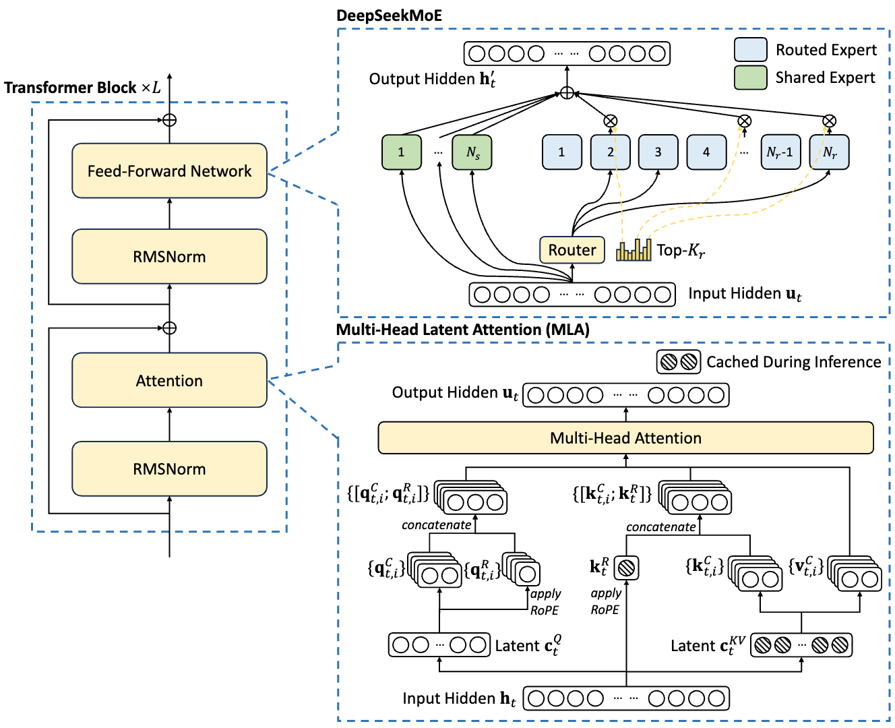
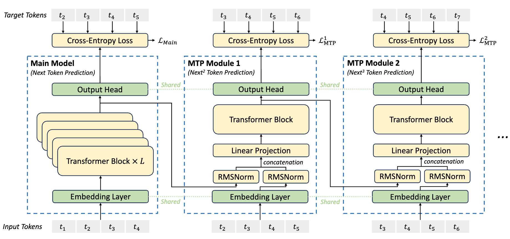

  
<h1>deepseek系列速览</h1>

	 
    

        <b>作者：</b><b>elfin</b>  
        <b>资料来源：<a href="https://github.com/deepseek-ai/DeepSeek-V3/blob/main/DeepSeek_V3.pdf">deepseek</a></b>
	

[toc]

---

# 1、deepseek-v3

    <b><a href="#top">Top</a></b>
	 <b>---</b> 
	<b><a href="#bottom">Bottom</a></b>

DeepSeek-V3模型是一个**混合专家模型(MoE)**，总共671B的参数，对于每一个token只激活37B。为了实现高效推理和训练，DeepSeek-V3采用了**多头潜在注意力(Multi-head Latent Attention: MLA)**和DeepSeekMoE架构，这些在DeepSeek-V2中已经验证过。针对负载平衡和多标签预测训练目标，DeepSeek-V3提出了辅助无损策略。

**结构创新点**：

1. 除DeepSeek-V2 的高效架构之外，我们还开创了一种用于负载均衡的**辅助无损策略**，该策略可以最大限度地减少因鼓励负载均衡而引起的性能下降。
2. 我们研究了多标记预测 （MTP） 目标，并证明它对模型性能有益。它还可用于推理加速的推测解码。

**训练前的创新点**：

1. 设计FP8 混合精度训练框架，并首次在超大规模模型上验证了 FP8 训练的可行性和有效性。
2. 通过算法、框架和硬件的协同设计，我们克服了跨节点 MoE 训练中的通信瓶颈，实现了近乎全的计算通信重叠。这显著提高了我们的训练效率并降低了训练成本，使我们能够在不增加开销的情况下进一步扩大模型大小。

**DeepSeek-R1 的知识提炼**：

1. 我们引入了一种创新的方法，将 longChain-of-Thought （CoT） 模型的推理能力提炼出来，特别是从 DeepSeek-R1 系列模型提炼到标准LLMs模型中，特别是 DeepSeek-V3。我们的管道优雅地整合了将 R1 的验证和反射模式引入 DeepSeek-V3，并显著提高其推理性能。同时，我们还保持对 DeepSeek-V3 的输出样式和长度的控制。

---

    <b><a href="#top">Top</a></b>
	 <b>---</b> 
	<b><a href="#bottom">Bottom</a></b>

## 1.1 MLA: Multi-head Latent Attention

### 1.1.1 K和V的通道降维

MLA 的核心是对注意力键和值的低秩联合压缩，以减少推理过程中的键值 （KV） 缓存:

$$
\begin{align}
\textcolor{blue}{C_{t}^{KV}} &= W^{DKV} h_{t},\qquad C_{t}^{KV} \in \mathbb{R}^{d_{c}},\quad h_{t} \in \mathbb{R}^{d_{h}},\quad W^{DKV} \in \mathbb{R}^{d_{c} \times d} \\
K_{t}^{C} = [ K_{t,1}^{C}, K_{t,2}^{C}, \dots, K_{t,n_{h}}^{C} ] &= W^{UK} C_{t}^{KV}, \qquad W^{UK} \in \mathbb{R}^{d_{h}n_{h} \times d_{c}} \\
\textcolor{blue}{K_{t}^{R}} &= \textcolor{green}{RoPE}( W^{KR} h_{t}), \qquad W^{KR} \in \mathbb{R}^{d_{h}^{R} \times d} \\
K_{t,i} &= \textcolor{green}{Cat}([K_{t,i}, K_{t}^{R}]) \\
V_{t}^{C} = [ V_{t,1}^{C}, V_{t,2}^{C}, \dots, V_{t,n_{h}}^{C} ] &= W^{UV} C_{t}^{KV}, \qquad W^{UV} \in \mathbb{R}^{d_{h}n_{h} \times d_{c}}
\end{align}
$$

- 这里的$W^{DKV}, W^{UK}, W^{UV}, W^{KR}$都是全连接算子的权重。
- 这里的$C$是compressed，意为压缩，即将$h_{t}$的通道压缩，使得$d_c \ll d_{h} * n_{h}$，其中$h_{t}$是标识第$t$个token的注意力输入，其通道数量是$d_{h}$，head的数量为$n_{h}$。
- $W^{KR}$是用于产生解耦的旋转位置编码(RoPE)的矩阵。
- $W^{UK}, W^{UV}$都是升维的矩阵。
- $Cat$是合并操作(绿色表示算子)。
- 上述蓝色张量是压缩过通道的，且需要缓存的，这可以让我们的缓存压力骤减，同时不影响识别效果(和多头注意力MHA相比)。

### 1.1.2 Query的通道降维

和Key、Value一样，作者也进行通道的压缩，以降低缓存压力。

$$
\begin{align}
C_{t}^{Q} &= W^{DQ} h_{t},\qquad C_{t}^{Q} \in \mathbb{R}^{d_{c}^{\prime}}, \quad W^{DQ} \in \mathbb{R}^{d_{c}^{\prime} \times d} \\
Q_{t}^{C} = [ Q_{t,1}^{C}, Q_{t,2}^{C}, \dots, Q_{t,n_{h}}^{C} ] &= W^{UQ} C_{t}^{Q}, \qquad W^{UQ} \in \mathbb{R}^{d_{h}n_{h} \times d_{c}^{\prime}}  \\
Q_{t}^{R} = [Q_{t,1}^{R}, Q_{t,2}^{R}, \dots, Q_{t,n_{h}}^{R} ] &= \textcolor{green}{RoPE}( W^{QR} C_{t}^{Q}), \qquad W^{DQ} \in \mathbb{R}^{d_{h}n_{h} \times d_{c}^{\prime}}  \\
Q_{t,i} &= \textcolor{green}{Cat}([Q_{t}^{C}, Q_{t,i}^{R}])
\end{align}
$$

- $C_{t}^{Q}$是Query的压缩后潜在张量。
- $W^{QR}$是用于解耦生成RoPE的矩阵。

### 1.1.3 MLA注意力

如1.1.1中定义的**键**$K_{j,i}$，**值**$V_{j,i}^{C}$，1.1.2中的**查询**$Q_{t,i}$，$i$标记了head的索引。
$$
\begin{align}
O_{t,i} &= \Sigma_{j=1}^{t}Softmax_{j}(\frac{Q_{t,i}^{T} \times K_{j,i}}{\sqrt{d_{h} + d_{h}^{R}}}) \times V_{j,i}^{C} \\
U_{t} &= W^{O} \times Cat([O_{t,1}, O_{t,2}, \dots, O_{t,n_{h}}])
\end{align}
$$

- $Cat$是合并所有头的特征。
- $W^{O}$是全连接映射权重，融合不同head的特征。

公式和MHA并没有实质差异，其关键区别还是在1.1.1和1.1.2，简述：

1. Query：先使用$W^{DQ}$进行通道降维，得到潜在Query表示，最后使用$W^{UQ}$进行升维，添加旋转位置编码(由潜在Query得到)，得到最后的Query；
2. Value：先使用$W^{DKV}$进行通道降维，得到潜在Value和Key的表示，最后使用$W^{UV}$进行升维，得到最后的Value；
3. Key：先使用$W^{DKV}$进行通道降维，得到潜在Value和Key的表示，最后使用$W^{UK}$进行升维，添加旋转位置编码(由输入$h_{t}$得到)，得到最后的Key；

> 注：上标的D表示降维，U表示升维

以上，总结就是QKV都存中间潜在特征，使用时使用维度还原矩阵相应还原，Key和Value在计算前还添加了位置编码，其余操作和MHA相似。

---

    <b><a href="#top">Top</a></b>
	 <b>---</b> 
	<b><a href="#bottom">Bottom</a></b>

## 1.2 具有辅助无损负载均衡的DeepSeekMoE

> 图中的列表内分号表示Cat操作！

### 1.2.1 DeepSeekMoE结构

在前馈神经网络(FFN)中，DeepSeek-V3采用了DeepSeekMoE结构。与传统的MoE结构(Shard)相比，DeepSeekMoE 使用更细粒度的专家，并将一些专家隔离为共享专家。令$U_{t}$表示第$t$个token的FFN输入，FFN的输出$h_{t}^{\prime}$可以如下表示：

$$
\begin{align}
h_{t}^{\prime} &= U_{t} + \Sigma_{i=1}^{N_{s}}{FFN_{i}^{(s)}(U_{t})} + \Sigma_{i=1}^{N_{r}}{g_{i,t}FFN_{i}^{(r)}(U_{t})} \\
g_{i,t} &= \frac{g_{i,t}^{\prime}}{\Sigma_{j=1}^{N_{r}}{g_{j,t}^{\prime}}} \\
g_{i,t}^{\prime} &= \begin{cases}
s_{i,t} \quad &s_{i,t} \in \text{TopK}(\left \{ s_{j,t} \mid 1 \le j \le N_{r} \right \}, K_{r})   \\ 
0, \quad & \text{otherwise}
\end{cases} \\
s_{i,t} &= \text{Sigmoid}(U_{t}^{T}e_{i})
\end{align}
$$

其中，$N_{s}, N_{r}$分别表示共享专家和路由专家的数量，$FFN_{i}^{(s)}(U(\cdot)), FFN_{i}^{(r)}(U(\cdot))$分别表示第$i$个共享专家和路由专家。$K_{r}$表示激活的路由专家数量，$g_{i,t}$表示第$i$个专家的门控值(softmax概率)，$s_{i,t}$是输入token和专家的关联性表示，是第$i$个专家的质心向量(特征表示)。$\text{TopK}(\cdot,K)$计算前K个有关联的专家。

### 1.2.2 辅助无损负载均衡

之前研究使用的是[辅助损失方案]()，但是过大的辅助损耗会损害模型性能。为了权衡模型性能和负载均衡，deepseek-v3给每个路由引入了一个偏置项（针对关联性得分$s_{i,t}$）。

$$
g_{i,t}^{\prime} = \begin{cases}
s_{i,t} \quad &\textcolor{orange}{s_{i,t}+ b_{i}}  \in \text{TopK}(\left \{ \textcolor{orange}{s_{j,t}+ b_{j}} \mid 1 \le j \le N_{r} \right \}, K_{r})   \\ 
0, \quad & \text{otherwise}
\end{cases}
$$

> Q1: 为🐎，MoE中不平衡的专家负载可能导致路由崩溃？
>
> 1. **资源瓶颈**：如果某些专家负载过高，计算资源会被过度占用，导致这些专家成为瓶颈，影响整体系统的吞吐量和延迟。
> 2. **路由决策失效**：路由网络依赖负载均衡来有效分配任务。若某些专家负载过重，路由网络可能无法合理分配输入，导致性能下降。
> 3. **专家利用不均**：负载不平衡会导致部分专家过度使用，而其他专家闲置，降低整体资源利用率，影响系统效率。
> 4. **训练不稳定**：在训练过程中，负载不平衡会导致某些专家过度训练，而其他专家训练不足，影响模型收敛和性能。
> 5. **系统扩展性受限**：负载不平衡会限制系统的扩展能力，因为新增资源可能无法有效利用，反而集中在少数专家上。
>
> Q2: 为什么添加偏置项就能实现负载均衡？
>
> 1. 因为作者会一直监督每个路由的负载情况，如果某个专家过载，作者会将偏置减去一个$\gamma$（超参数），反之会添加一个偏置增量$\gamma$。
> 2. 通过$\gamma$即可实现每个专家的负载均衡。具体实现要参考源代码。
>
> Note：在DeepSeekMoE结构中，由transformer的位置编码脑补了$s_{i,t}$也可以添加一个类似位置编码(偏置)的项，灵感来的莫名其妙，不知道作者添加偏置的想法是如何得出的？当然作者只是在TopK的时候才加偏置(即论文说的仅routing时)，并不是计算得分时添加。

通过动态调整，DeepSeek-V3 在训练过程中保持平衡的专家负载，并取得了比通过纯辅助损失鼓励负载均衡的模型更好的性能。

### 1.2.3 互补序列辅助损失

虽然 DeepSeek-V3 主要依靠辅助无损策略进行负载均衡，但为了防止任何单个序列内的极端不平衡，我们还采用了**互补序列平衡损失**（设计了一种目标函数）。

$$
\begin{align}
\mathcal{L}_{bal} &= \alpha \Sigma_{i=1}^{N_{r}}{f_{i}P_{i}} \\
f_{i} &= \frac{N_{r}}{K_{r}T} \Sigma_{i=1}^{T}{\mathbb{I}(s_{i,t} \in \text{TopK}(\left \{ s_{j,t} \mid 1 \le j \le N_{r} \right \}, K_{r}))} \\
s_{i,t}^{\prime} &= \frac{s_{i,t}}{\Sigma_{j=1}^{N_{r}}{s_{j,t}}} \\
P_{i} &= \frac{1}{T} \Sigma_{t=1}^{T}{s_{i,t}^{\prime}}
\end{align}
$$

- 针对某个token，计算第$i$个专家的关联性得分Softmax值，得到概率得分$s_{i,t}^{\prime}$；
- 对所有token的$s_{i,t}^{\prime}$求平均，得到其被激活的概率值，表示其负载；
- $f_{i}$标识了每个路由专家要处理的token数量;(参考熵)

互补序列辅助损失，进一步激励模型让token均衡分配到不同的路由专家。

**总结**：基于上述三节的内容，DeepSeekMoE结构实现了：

1. 没有token被抛弃；
2. 实现专家路由激活节点的限制；
3. 专家路由的负载均衡。

---

    <b><a href="#top">Top</a></b>
	 <b>---</b> 
	<b><a href="#bottom">Bottom</a></b>

## 1.3 MTP 多token预测

### 1.3.1 MTP模型

MTP任务设计如图所示：

如图所示：

- 第$k$个MTP模块共享主分支的嵌入层$Emb(\cdot)$，共享输出头$OutputHead(\cdot)$，以及独享一个Transformer模块$TRM_{k}(\cdot)$和一个投射矩阵$M_{k} \in \mathbb{R}^{d \times 2d}$。

- 对于第$i$个token在第$k$个预测深度，MTP模块是将第$k-1$个深度$i$个token的表示$\mathbf{h}_{i}^{k-1} \in \mathbb{R}^{d}$和第$i+k$个token的位置编码($Emb(t_{i+k}) \in \mathbb{R}^{d}$)分别经过$RMSNorm$处理，再合并，作为线性映射的输入:
    
    $$
    \mathbf{h}_{i}^{\prime k} = M_{k}[\textcolor{green}{RMSNorm}(\mathbf{h}_{i}^{k-1});\textcolor{green}{RMSNorm}(\textcolor{green}{Emb}(t_{i+k}))]
    $$

- 组合第$k$个深度对应token的$\mathbf{h}_{i}^{\prime k}$作为Transformer模块的输入，经过$TRM_{k}(\cdot)$函数得到$\mathbf{h}_{i}^{k}$。
    
    $$
    \mathbf{h}_{1:T-k}^{k} = \textcolor{green}{TRM_{k}}(\mathbf{h}_{1:T-k}^{\prime k})
    $$
    
    其中，$1:T-k$是序列1到T的一个长度为k的切片。

- 将切片对应的$\mathbf{h}_{i}^{k}$组合作为共享头$OutputHead(\cdot)$的输入，输出第$k$个附加预测的概率：
    
    $$
    P_{i+k+1}^{k} = \textcolor{green}{OutputHead}(\mathbf{h}_{i}^{k}), \quad P_{i+k+1}^{k} \in \mathbb{R}^{V}
    $$

    $V$是词典的大小。

### 1.3.2 MTP损失设置

对于每一个预测深度，我们都设置一个交叉熵损失：
$$
\mathcal{L}_{MTP}^{k} = \textcolor{green}{CrossEntropy}(P_{2+k:T+1}^{k},t_{2+k:T+1}) = - \frac{1}{T} \Sigma_{i=2+k}^{T+1}{log P_{i}^{k}[t_{i}]}
$$
其中，$T+1$超出了序列索引？因为我们的GT是下一个时刻的输出，所以我们要预测多一个，这样才能和GT进行对齐；其中$P_{i}^{k}[t_{i}]$是第$k$个深度预测对$t_{i}$的预测概率。引入一个MTP因子$\lambda$，整合所有MTP头损失，最后得到平均MTP损失：
$$
\mathcal{L}_{MTP} = \frac{\lambda}{D} \Sigma_{k=1}^{D}{\mathcal{L}_{MTP}^{k}}
$$

推理时我们直接忽略MTP头即可，只使用主模型预测。

---

    <b><a href="#top">Top</a></b>
	 <b>---</b> 
	<b><a href="#bottom">Bottom</a></b>

---

    <b><a href="#top">Top</a></b>
	 <b>---</b> 
	<b><a href="#bottom">Bottom</a></b>

# deepseek系列参考

- [Deepseek-v3论文](https://github.com/deepseek-ai/DeepSeek-V3/blob/main/DeepSeek_V3.pdf)

    <b>完！</b>

